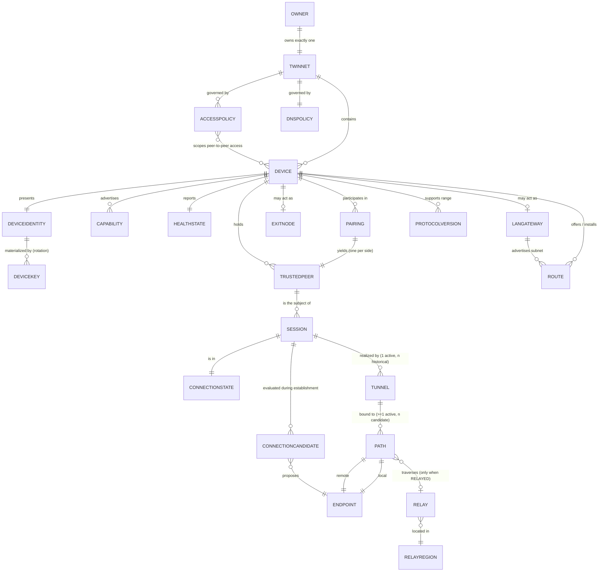

# TwinVPN — System Architecture

**Scope.** This is the anchor structural document for TwinVPN. It defines the components and
their responsibilities, the domain model and its vocabulary, the separation of control / data /
management planes, and — most importantly — the **state ownership table** (§5) that names a
single authoritative writer for every persistent fact in the system. Other documents specify
*how* individual mechanisms work; this document specifies *where they live, what they own, and
what happens when they are gone*. Where a decision belongs to another ADR, this document states
the **interface it requires** and defers the decision by ADR number.

**Related documents**

- [docs/vision.md](vision.md) — product thesis, non-goals, defect-to-requirement table (R-01…R-24)
- [docs/protocol.md](protocol.md) — wire contracts, control-plane messaging, versioning
- [docs/networking.md](networking.md) — NAT traversal, IPv4/IPv6 routing, DNS
- [docs/reliability.md](reliability.md) — **authoritative** connection state machine, relays, recovery
- [docs/threat-model.md](threat-model.md) — adversaries and threat analysis across the boundaries defined here
- [docs/testing-strategy.md](testing-strategy.md) — verification and conformance
- [docs/application-architecture.md](application-architecture.md) — **the application and platform layer**: processes, privilege, the management interface, packaging, embedded (components 2.23–2.30, state rows S-38 … S-68)
- Owned ADRs: [ADR-0008 Idempotency](adr/ADR-0008-idempotency.md) ·
  [ADR-0009 State Consistency](adr/ADR-0009-state-consistency.md) ·
  [ADR-0013 Multi-Client Gateway Architecture](adr/ADR-0013-multi-client-gateway-architecture.md)

**Normative language.** MUST / MUST NOT / SHOULD / MAY per RFC 2119.

---

## 1. Architecture at a glance

TwinVPN is a **thick-edge, thin-infrastructure** system. Devices hold identity, policy, and
tunnel state; infrastructure holds only what devices provably cannot hold themselves —
rendezvous for peers that cannot yet reach each other, and relay forwarding for peers that
never will directly.

```
                        ┌──────────── MANAGEMENT PLANE ────────────┐
                        │  Admin/UI · Telemetry sink · Update svc  │
                        └──────────────────┬───────────────────────┘
                                           │ (observes; never in the datapath)
   ┌──────────────── CONTROL PLANE (availability-tolerant) ────────────────┐
   │  Control Plane Service · Rendezvous · Relay-Selection · Presence      │
   │  Authoritative for: TwinNet membership, revocation, policy, relay set │
   └──────┬────────────────────────────────────────────────────────┬──────┘
          │ signed, versioned, cacheable state (pull + push)       │
          ▼                                                        ▼
   ┌─────────────────┐                                     ┌─────────────────┐
   │  Device A       │      ══ DATA PLANE (must not ══     │  Device B       │
   │  (client /      │      ══ depend on control) ══       │  (gateway /     │
   │   exit / LAN gw)│◀───────── direct  Path ────────────▶│   exit / LAN gw)│
   └─────────────────┘                                     └─────────────────┘
          │                                                        │
          └──────────────▶ ┌────────────────────┐ ◀────────────────┘
                           │ Relay (ciphertext- │
                           │ only, zero-know.)  │   I1: cannot decrypt
                           └────────────────────┘
```

Three structural rules follow from the invariants and are enforced throughout:

- **I1 / P1** — the `Relay` is on the data plane but *outside* the trust boundary. It forwards
  frames it cannot interpret.
- **I5 / P5** — no established-tunnel code path may call the control plane. §4.4 gives the
  enforcement mechanism.
- **I8 / P8** — every persistent fact in §5 has exactly one authoritative writer.

## 2. Components

Each component is specified with: **Plane**, **Purpose**, **Responsibilities**,
**Non-responsibilities** (what it MUST NOT do — these prevent the responsibility creep that
turns a plane separation into a diagram-only fiction), **State owned**, **Depends on**, and
**Failure behavior**.

### 2.1 TwinVPN Client

| | |
|---|---|
| **Plane** | Data plane + control-plane *client* + local device state |
| **Purpose** | The per-`Device` agent. Establishes and maintains `Session`s to `TrustedPeer`s, programs the local network stack, enforces local policy. The same binary is the client, the `ExitNode`, and the `LANGateway` — role is configuration, not a separate product (see §2.2). |
| **Responsibilities** | Own the local `ConnectionState` machine per peer; drive candidate gathering and path selection; own the local firewall/route/DNS program; surface structured diagnostics; hold and use `DeviceKey`; run headless on Linux/router targets with the same control contract as the GUI (R-21). |
| **Non-responsibilities** | MUST NOT hold any key belonging to another `Device`. MUST NOT be authoritative for `TwinNet` membership or revocation. MUST NOT require control-plane reachability to keep an established `Session` alive (I5). MUST NOT decide relay topology — it consumes a ranked set. |
| **State owned** | Local `ConnectionState`, local `Path` set, kill-switch engagement, cached copies of all control-plane state, local diagnostic ring buffer. See §5. |
| **Depends on** | Platform Network Adapter (2.5), Tunnel Engine (2.3), Device Identity (2.6), Config/State Storage (2.20), Control Plane (2.8) *for new operations only*. |
| **Failure behavior** | Process crash MUST NOT open a leak: the kill-switch rule set is installed at OS level and survives the process (R-13, [ADR-0012]). On restart the client rehydrates from durable local state and re-enters `RECONNECTING`, not `DISCONNECTED`-from-scratch — **subject to the three exceptions below, because a restart is not consent.** Read without them, this rule re-dials a peer the `Owner` deliberately disconnected and re-attempts a terminal failure on every boot. On restart: (a) a `Session` the `Owner` explicitly disconnected stays `DISCONNECTED` until the `Owner` acts; (b) a `Session` in a terminal `FAILED` state whose `reason_code` class is `FATAL` or `POLICY` does **not** silently retry — it rehydrates as `FAILED` with its original `reason_code` preserved; (c) everything else re-enters `RECONNECTING`. Rule owned with the rehydration contract in [ADR-0022](adr/ADR-0022-application-lifecycle-and-background-execution.md) LC-2. |

### 2.2 TwinVPN Gateway / Server role

| | |
|---|---|
| **Plane** | Data plane |
| **Purpose** | The multi-peer serving role of a `Device`: terminating many concurrent peer `Tunnel`s and forwarding beyond itself, as `ExitNode` (to the Internet) and/or `LANGateway` (to local subnets). **Not a separate product**: a single `Device` MAY simultaneously be a client to peer X, an `ExitNode` for peer Y, and a `LANGateway` for peer Z. |
| **Responsibilities** | Per-peer isolation, per-peer `Route`/NAT/`AccessPolicy` binding, per-peer resource accounting and fairness, connection admission and limits, deterministic per-peer address assignment with **no DHCP in the datapath** (R-03). |
| **Non-responsibilities** | MUST NOT serialize peers (I7 — one-at-a-time is a defect class). MUST NOT apply one peer's `AccessPolicy` to another's traffic. MUST NOT be authoritative for `AccessPolicy` content — it enforces the policy document it was given. |
| **State owned** | Per-peer datapath state: peer→interface/table binding, NAT translation table, per-peer counters and quota state. Ephemeral; reconstructible. |
| **Depends on** | Packet-Routing Engine (2.4), Policy Engine (2.14), Tunnel Engine (2.3). |
| **Failure behavior** | Peer-level failures are isolated: one peer's session collapse, quota exhaustion, or policy denial MUST NOT affect other peers. Gateway restart re-derives all per-peer addressing deterministically, so peers reconnect to the *same* addresses. Full design: [ADR-0013](adr/ADR-0013-multi-client-gateway-architecture.md). |

### 2.3 Tunnel Engine

| | |
|---|---|
| **Plane** | Data plane |
| **Purpose** | Cryptographic transport. Owns the handshake, key schedule, rekey, replay protection, and framing for a `Tunnel`. |
| **Responsibilities** | Peer authentication against `TrustedPeer` public keys; encrypt/decrypt/authenticate; rekey on time/volume thresholds; expose `Path`-independent send/receive so a `Path` swap is invisible above it (R-05, R-07); **refuse a handshake from a revoked `DeviceIdentity`** (see §4.5). |
| **Non-responsibilities** | MUST NOT choose paths, discover peers, or contact the control plane. MUST NOT implement novel cryptography (I2 / P2). MUST NOT be reachable by the `Relay` in plaintext (I1). |
| **State owned** | Live key state and replay windows — **memory-only, never persisted**. |
| **Depends on** | Device Identity (2.6) for the local static key; the protocol and primitive choice is **deferred to [ADR-0001]**. |
| **Failure behavior** | Handshake failure and decrypt failure produce distinct `reason_code`s (R-22). Rekey failure MUST tear down the `Tunnel` and MUST NOT continue on stale keys. |
| **Interface required from [ADR-0001]** | (a) A `Path`-independent session that survives endpoint change without re-authentication; (b) rekey without renegotiating identity; (c) an authenticated peer identifier that binds 1:1 to `DeviceIdentity`; (d) a defined "peer key is revoked → reject" hook. |

### 2.4 Packet-Routing Engine

| | |
|---|---|
| **Plane** | Data plane |
| **Purpose** | Decides, per packet, which `Tunnel` (or the physical link, or the bit bucket) a packet belongs to, for **IPv4 and IPv6 equally** (P9). |
| **Responsibilities** | `Route` table construction from `TwinNet` addressing, subnet routes, and exit-node default routes; per-peer policy routing on a gateway; source-address selection; MTU/MSS handling for both families (R-15); loop and collision detection against pre-existing routes (R-17). |
| **Non-responsibilities** | MUST NOT make a family-asymmetric decision (a v4-only guard is a leak, R-14). MUST NOT own firewall/kill-switch rules — that is 2.16. MUST NOT resolve names — that is 2.15. |
| **State owned** | Effective `Route` table and per-peer routing bindings (derived, not authoritative). |
| **Depends on** | Platform Network Adapter (2.5). Routing rules **deferred to [ADR-0010]**. |
| **Failure behavior** | A route program that cannot be applied MUST fail the connection attempt with a named conflict diagnostic, MUST NOT partially apply, and MUST roll back (see idempotent apply, [ADR-0008](adr/ADR-0008-idempotency.md) §11). |

### 2.5 Platform Network Adapter

| | |
|---|---|
| **Plane** | Data plane (local) |
| **Purpose** | The single seam between TwinVPN and each operating system's virtual-network, firewall, DNS, and background-execution facilities. Confining OS variance to one component is what makes R-19/R-20 tractable. |
| **Responsibilities** | Create/configure/destroy the virtual interface; program routes, firewall rules, and resolver settings through the OS-sanctioned API; own the per-OS background/lifecycle contract (R-08); publish a **capability probe** at startup declaring what this OS/version can actually do. |
| **Non-responsibilities** | MUST NOT ship a bespoke kernel driver where the OS provides a supported API (R-19). MUST NOT leak platform quirks upward as untyped errors — every platform limitation becomes a declared `Capability` or a named `reason_code`. |
| **State owned** | Handles to OS-owned objects (interface, rule set, resolver config) and the capability-probe result. |
| **Depends on** | Nothing internal; it is the bottom of the stack. |
| **Failure behavior** | An unmet capability is a **startup-time named failure**, never a runtime surprise. If the OS revokes the interface (sleep, VPN-API preemption, user action), the adapter reports interface-loss and the client enters `RECONNECTING` while the kill-switch rule set stays installed. |
| **Platform capability matrix (structural)** | Linux (kernel WireGuard module or userspace TUN; nftables/iptables; systemd-resolved / resolv.conf) · Windows (WinTun-class virtual adapter; WFP filters; NRPT for DNS) · macOS (NetworkExtension `packet-tunnel`; pf/NE rules; system resolver via NE) · iOS (NetworkExtension, on-demand rules, strict background/memory limits) · Android (`VpnService`, always-on + block-non-VPN, Doze constraints) · Router/OpenWrt (kernel module, nftables, no GUI, low memory). Concrete per-OS mechanism choice is **deferred to [ADR-0010], [ADR-0011], [ADR-0012]**. |

#### 2.5.1 `PLATFORM` reason codes (discharging the ADR-0015 §11.2 domain assignment)

**Sub-ownership note.** [ADR-0015](adr/ADR-0015-observability-and-diagnostics.md) §11.2 assigns the
whole `PLATFORM` domain to this component (2.5, the Platform Network Adapter), but **host-process
lifecycle is not a network-adapter concern**. The domain is therefore split by subdomain:
`PLATFORM.*` bare codes remain 2.5's; `PLATFORM.PRIV.*` and `PLATFORM.SERVICE.*` are
[ADR-0016](adr/ADR-0016-client-process-and-privilege-separation.md)'s; `PLATFORM.LIFECYCLE.*` is
[ADR-0022](adr/ADR-0022-application-lifecycle-and-background-execution.md)'s; `PLATFORM.EMBEDDED.*`
is [ADR-0023](adr/ADR-0023-headless-cli-and-embedded-profile.md)'s.

**Three host-process conditions had no code, and a UI cannot render what it cannot name.** A client
that finds no authority must distinguish these, because their next actions differ completely — and
"cannot reach the service" rendered identically for all three is the I6 defect at the last inch:

| Condition | Code (owner: [ADR-0016](adr/ADR-0016-client-process-and-privilege-separation.md)) | Why it is distinct |
|---|---|---|
| The product is not installed | `PLATFORM.SERVICE.NOT_INSTALLED` | Nothing is protecting this host and nothing claims to be |
| Installed, not running | `PLATFORM.SERVICE.UNAVAILABLE` | The rule set may still be installed and enforcing (R-13), so the host may be **protected but unmanageable** — the opposite of the previous row |
| Installed, held down by crash-loop containment | `PLATFORM.SERVICE.QUARANTINED` | Deliberate, not a fault to retry; carries the containment reason from S-40 |

The **`UNKNOWN`** indicator that renders these MUST be visually distinct from **both** connected and
disconnected ([ADR-0019](adr/ADR-0019-application-state-model-and-ui-architecture.md) §11.9) — a
host that is protected but unmanageable must not read as either.


[ADR-0015](adr/ADR-0015-observability-and-diagnostics.md) §11.2 assigns the **`PLATFORM`** domain
to this component, because it is the only one that touches the OS integration surface these
conditions describe. R-19 and R-20 depend on them being named rather than surfaced as generic
failures.

| Code | Class | Severity | Terminal | User-actionable | Condition |
|---|---|---|---|---|---|
| `PLATFORM.VPN_PERMISSION_DENIED` | PERSISTENT | ERROR | no | **yes** | The OS refused the VPN entitlement or the user declined the permission prompt. Actionable: grant it |
| `PLATFORM.ADAPTER_UNAVAILABLE` | PERSISTENT | ERROR | no | **yes** | The virtual adapter could not be created or was removed. On Windows this is the stale-driver case R-19 names |
| `PLATFORM.THIRD_PARTY_FILTER_SUSPECTED` | PERSISTENT | WARN | no | **yes** | Another endpoint-security or VPN product appears to be filtering or claiming the adapter (R-20). Never resolved by clobbering ([docs/networking.md](networking.md) §5.5) |
| `PLATFORM.OS_UNSUPPORTED` | FATAL | ERROR | yes | **yes** | The OS version is below the supported floor |
| `PLATFORM.PROCESS_RESTARTED` | TRANSIENT | INFO | no | no | Planned agent restart; peers are told so they do not mark the path failed |
| `PLATFORM.PROCESS_CRASHED` | TRANSIENT | ERROR | no | no | Unplanned agent exit. Enforcement rules survive it by requirement (S-18) |
| `PLATFORM.CRASH_LOOP` | PERSISTENT | CRITICAL | no | **yes** | Repeated crashes within a window; the agent stops auto-restarting rather than thrashing |
| `PLATFORM.SUSPENDED` / `PLATFORM.RESUMED` | TRANSIENT | INFO | no | no | Host suspend and resume, driving the park and wake paths of [docs/reliability.md](reliability.md) §11 |
| `PLATFORM.BACKGROUND_SUSPENDED` | TRANSIENT | INFO | no | no | Mobile OS backgrounding; keepalives are parked per [docs/reliability.md](reliability.md) §11.2 |
| `PLATFORM.SCREEN_LOCKED` | TRANSIENT | INFO | no | no | Device locked; informational input to the background profile |
| `PLATFORM.INTERNAL_FAULT` | FATAL | CRITICAL | yes | no | An adapter-layer invariant failed. Every occurrence is a defect |

---

### 2.6 Device Identity Subsystem
| | |
|---|---|
| **Plane** | Local device state (authoritative) |
| **Purpose** | Custody of `DeviceKey` and derivation/presentation of `DeviceIdentity`. |
| **Responsibilities** | Generate the keypair inside platform secure storage; perform signing/agreement operations **without** exporting the private half (I4 / P4); present the public `DeviceIdentity`; support key rotation as an explicit, auditable transition. |
| **Non-responsibilities** | MUST NOT export, back up, escrow, or transmit private key material — to the control plane or to any peer. MUST NOT accept an identity minted elsewhere as a substitute. |
| **State owned** | `DeviceKey` (private half; local-only authority, non-replicable by construction). |
| **Depends on** | Platform secure storage. Choice **deferred to [ADR-0007]**. |
| **Failure behavior** | If secure storage is unavailable or the key is unreadable, the `Device` MUST fail closed to `FAILED` with a distinct `reason_code` and MUST NOT silently generate a replacement identity (a silently rotated identity is indistinguishable from a compromise). |
| **Interface required from [ADR-0007]** | A stable, self-certifying `device_id` **derived from the public key** rather than assigned by a server — so identity remains locally authoritative and the control plane merely *records* it. If [ADR-0007] instead assigns server-side identifiers, §5 changes and this is a contradiction to resolve. |

### 2.7 Pairing Subsystem

| | |
|---|---|
| **Plane** | Control plane (assisted), with the authoritative result stored on both devices |
| **Purpose** | Turn two mutually-unknown `Device`s into a mutual `TrustedPeer` pair inside one `TwinNet`. |
| **Responsibilities** | Run the out-of-band-verified `Pairing` ceremony; record the resulting `TrustedPeer` on **both** devices; register the membership fact with the control plane; support revocation initiation. |
| **Non-responsibilities** | MUST NOT make the control plane the *sole* holder of the trust relationship — otherwise I5/R-11 fail. MUST NOT allow pairing to be completed without an out-of-band human verification step. |
| **State owned** | `Pairing` records (local, durable) and the local `TrustedPeer` set. |
| **Depends on** | Device Identity (2.6), Control Plane (2.8). Ceremony **deferred to [ADR-0007]**. |
| **Failure behavior** | Pairing is idempotent and replay-safe: a retried or duplicated ceremony converges on one `Pairing`, never two half-states ([ADR-0008](adr/ADR-0008-idempotency.md) §11). An interrupted ceremony leaves *no* partial trust. |

### 2.8 Control Plane Service

| | |
|---|---|
| **Plane** | **Control plane** |
| **Purpose** | The coordination authority for a `TwinNet`: membership, revocation, policy distribution, and the directory of devices and their capabilities. |
| **Responsibilities** | Authoritative store for `TwinNet` membership, revocation, `AccessPolicy`, `DNSPolicy`, and `Capability` advertisements; issue **signed, monotonically versioned** state documents devices can verify and cache offline; accept idempotent writes ([ADR-0008]); push change notifications. |
| **Non-responsibilities** | MUST NOT observe, carry, proxy, or be able to decrypt tunnel traffic (I1). MUST NOT hold any `DeviceKey` private half (I4). MUST NOT be on any established-session code path (I5). MUST NOT be required for a device to re-establish a `Session` with an already-known `TrustedPeer`. |
| **State owned** | See §5 — it is the single authoritative writer for membership, revocation, policy, and relay-fleet registry. |
| **Depends on** | Durable storage; messaging/eventing **deferred to [ADR-0002]**; schema **deferred to [ADR-0003]**. |
| **Failure behavior** | **Outage is a supported operating mode** (§4.4). Established `Session`s continue. New pairings, policy changes, revocations, and first-contact with a never-before-seen peer degrade or block. Devices operate from signed cached state until its TTL expires; TTL expiry consequences are per state class ([ADR-0009](adr/ADR-0009-state-consistency.md) §11). |

### 2.9 Rendezvous / Discovery Service

| | |
|---|---|
| **Plane** | Control plane |
| **Purpose** | Let two devices that cannot yet reach each other exchange `ConnectionCandidate` sets and coordinate simultaneous open. |
| **Responsibilities** | Relay small, signed, end-to-end-authenticated signalling blobs between paired devices; report observed public `Endpoint` (server-reflexive address) for v4 and v6; coordinate hole-punch timing. |
| **Non-responsibilities** | MUST NOT read signalling payload it is not required to read (candidate exchange SHOULD be end-to-end authenticated between devices, with rendezvous as an untrusted courier). MUST NOT be required after a `Path` is established. MUST NOT carry tunnel data. |
| **State owned** | Ephemeral, seconds-to-minutes signalling state only. Nothing durable. |
| **Depends on** | Control Plane (2.8) for authorization; traversal semantics **deferred to [ADR-0004]**. |
| **Failure behavior** | Unavailability blocks *new* direct-path negotiation with peers whose `Endpoint` is unknown. It MUST NOT block: (a) reconnection using a cached `Endpoint`, (b) `LOCAL_DIRECT` via local discovery (2.17), (c) relay-first establishment if the relay path is reachable. |

### 2.10 NAT Traversal Subsystem

| | |
|---|---|
| **Plane** | Data plane (client-side), assisted by control plane |
| **Purpose** | Produce a working `Path` between two `Endpoint`s across arbitrary NAT/firewall conditions. |
| **Responsibilities** | Gather `ConnectionCandidate`s (host / server-reflexive / relay-reflexive, **v4 and v6**); race candidates; validate paths; select and promote the winner; keep probing for a better path while `RELAYED` (R-12); run the transport fallback ladder for firewall/AV interference (R-18). |
| **Non-responsibilities** | MUST NOT declare connection failure merely because the *direct* path failed — relay fallback is mandatory (R-02). MUST NOT emit unauthenticated traffic that could be mistaken for an established tunnel. |
| **State owned** | Live candidate ledger per attempt (feeds the diagnostic in R-23). |
| **Depends on** | Rendezvous (2.9), Relay Selection (2.12). Technique choice **deferred to [ADR-0004]**. |
| **Failure behavior** | Bounded deadline per phase; on expiry, transitions per the state machine in [docs/reliability.md](reliability.md), always with a candidate-level explanation. |

### 2.11 Relay Infrastructure

| | |
|---|---|
| **Plane** | Data plane, **outside the trust boundary** |
| **Purpose** | Forward opaque ciphertext between two peers that cannot form a direct `Path`. |
| **Responsibilities** | Accept authenticated-but-opaque flows; forward frames; enforce per-flow fairness and abuse limits; publish health/capacity for selection. |
| **Non-responsibilities** | **MUST NOT hold any key capable of decrypting tunnel traffic (I1 — inviolable).** MUST NOT terminate or re-originate the tunnel's cryptographic session. MUST NOT be authoritative for any `TwinNet` state. |
| **State owned** | Ephemeral per-flow forwarding state and its own `HealthState` (which it *reports*; the authority for the fleet-level view is the relay-selection service). |
| **Depends on** | Control Plane (2.8) for admission/authorization. Design **deferred to [ADR-0005]**. |
| **Failure behavior** | Relay loss MUST be survivable: failover to an alternate `Relay` is a `MIGRATING` transition, not a `Session` teardown (R-10). |
| **Interface required from [ADR-0005]** | (a) A relay flow is addressable by a token/handle that is *not* the peers' identity keys; (b) a peer can hold a **warm standby** flow on a second relay without doubling data cost; (c) relay admission does not require a live control-plane call per packet or per reconnect (I5). |

### 2.12 Relay-Selection Service

| | |
|---|---|
| **Plane** | Control plane |
| **Purpose** | Give a device a **ranked, health-filtered** candidate set of `Relay`s per `RelayRegion`. |
| **Responsibilities** | Aggregate relay `HealthState`; publish the ranked set as signed, versioned, cacheable state; incorporate client-measured RTT (R-12). |
| **Non-responsibilities** | MUST NOT be a per-connection call — the ranked set is *cached state*, so relay failover works during a control-plane outage (I5). MUST NOT be the sole input: the client's own measurements override stale rankings. |
| **State owned** | The relay-fleet registry and ranking (authoritative). |
| **Depends on** | Control Plane (2.8). Failover policy **deferred to [ADR-0006]**. |
| **Failure behavior** | Unavailability means the client uses its cached ranked set. The set MUST carry enough alternates that cache-only operation still permits failover — a cached set of size 1 is a design error. |

### 2.13 Device-Presence Service

| | |
|---|---|
| **Plane** | Control plane |
| **Purpose** | Answer "is peer X likely online, and at which `Endpoint`?" — a **hint service**, never an authority. |
| **Responsibilities** | Track device online/offline heartbeats and last-known `Endpoint`s; notify subscribed peers of change so a stalled reconnect can be woken. |
| **Non-responsibilities** | MUST NOT gate connection attempts ("presence says offline" MUST NOT prevent an attempt — presence is eventually consistent and can be wrong). MUST NOT be treated as authoritative for reachability; only a validated `Path` proves reachability. |
| **State owned** | Presence and last-known-endpoint records — explicitly **eventually consistent**, TTL'd ([ADR-0009](adr/ADR-0009-state-consistency.md)). |
| **Depends on** | Control Plane (2.8), messaging **deferred to [ADR-0002]**. |
| **Failure behavior** | Unavailability degrades reconnect *latency* (clients fall back to timer-driven retry with cached endpoints), not reconnect *capability*. |

### 2.14 Policy Engine

| | |
|---|---|
| **Plane** | Trust plane (authorship, 2.22) + control plane (distribution) + data plane (enforcement) |
| **Purpose** | Evaluate `AccessPolicy` and `DNSPolicy` — **authored by the `Owner` authority (2.22)**, distributed by the control plane, **enforced at both endpoints**. |
| **Responsibilities** | Evaluate peer-to-peer access, subnet-route acceptance, exit-node use, and DNS behavior; apply per-peer on a multi-client gateway ([ADR-0013]); enforce **monotonic** policy versioning so a device cannot be walked backwards to a weaker policy ([ADR-0009](adr/ADR-0009-state-consistency.md) §11). |
| **Non-responsibilities** | MUST NOT rely on enforcement at one end only — a compromised or buggy peer MUST NOT be able to exceed the policy by not enforcing it locally. MUST NOT fail *open* when policy is unavailable: the last known-good signed policy applies, and if none exists, deny. MUST NOT accept a policy bundle signed by anything other than an `Owner`-delegated key, **including one presented by an authenticated control plane**. |
| **State owned** | Enforcement-side effective policy (cache). **Authority lives with the `Owner` (2.22), not the Control Plane (2.8)** — this is what makes a compromised control plane unable to disable every kill switch in the fleet ([docs/protocol.md](protocol.md) §13.4, [docs/threat-model.md](threat-model.md) §10.1). The control plane can *withhold* a policy update; it can never *author* one. |
| **Depends on** | Control Plane (2.8), Packet-Routing Engine (2.4), DNS Subsystem (2.15). |
| **Failure behavior** | Policy-fetch failure → continue on last known-good signed policy (monotonic, never downgrade). Policy *expiry* → per class in [ADR-0009]. |

### 2.15 DNS Subsystem

| | |
|---|---|
| **Plane** | Data plane, governed by control-plane `DNSPolicy` |
| **Purpose** | Resolve `TwinNet` device names and enforce split/full DNS behavior without leaking queries (R-14). |
| **Responsibilities** | Serve `TwinNet` names; apply split-horizon per `DNSPolicy`; intercept system resolution using the OS-sanctioned mechanism (2.5); handle **IPv4 and IPv6 records and IPv6 transport equally** (P9). |
| **Non-responsibilities** | MUST NOT fall back to the unprotected system resolver while protected traffic is active. MUST NOT leave IPv6 DNS unhandled while handling IPv4 — that is a leak, not a partial implementation. |
| **State owned** | Local resolver configuration and cache (derived). |
| **Depends on** | Platform Network Adapter (2.5). Behavior **deferred to [ADR-0011]**. |
| **Failure behavior** | Resolver-program failure while the kill switch is engaged MUST result in `BLOCKED`, not in a silent fallback to the system resolver. |

### 2.16 Kill-Switch / Leak-Prevention Subsystem

| | |
|---|---|
| **Plane** | Local device state (authoritative) — deliberately **not** control plane |
| **Purpose** | Guarantee that protected traffic never egresses outside an authorized secure path (I3 / R-13 / R-14). |
| **Responsibilities** | Install an OS-level dual-family (v4 **and** v6) rule set that survives process death, crash, update, and reboot; drive the `BLOCKED` state; permit only the narrow exceptions required to re-establish a path (tunnel handshake, relay endpoints, rendezvous), enumerated explicitly. |
| **Non-responsibilities** | MUST NOT depend on the TwinVPN process being alive. MUST NOT depend on control-plane reachability to *stay* engaged. MUST NOT open on ambiguity — ambiguity resolves closed. |
| **State owned** | Kill-switch engagement (durable, local authority — see §5). |
| **Depends on** | Platform Network Adapter (2.5). Design **deferred to [ADR-0012]**. |
| **Failure behavior** | If the rule set cannot be installed, the client MUST refuse to enter a protected state and MUST report why. "Couldn't protect, so proceeded unprotected" is the defect this component exists to eliminate. |

### 2.17 Local-LAN Discovery

| | |
|---|---|
| **Plane** | Data plane (local segment) |
| **Purpose** | Find `TrustedPeer`s on the same L2 segment to establish `LOCAL_DIRECT` **without any infrastructure at all**. |
| **Responsibilities** | Multicast/broadcast peer announcement over IPv4 and IPv6 link-local; produce host `ConnectionCandidate`s; authenticate discovered peers cryptographically before use. |
| **Non-responsibilities** | MUST NOT trust a discovery response as authentication — discovery yields *candidates*, and only the tunnel handshake establishes trust. MUST NOT announce information that identifies the `Owner` to unpaired observers on the segment. |
| **State owned** | Ephemeral local candidate cache. |
| **Depends on** | Tunnel Engine (2.3) for authentication. |
| **Failure behavior** | Discovery being blocked (common on guest/AP-isolated networks) degrades to `WAN_DIRECT`/`RELAYED` with a named reason — never a hard failure. This component is the reason a `TwinNet` still works on an isolated LAN with **no** Internet. |

### 2.18 Exit-Node Functionality

| | |
|---|---|
| **Plane** | Data plane |
| **Purpose** | Forward a peer's Internet-bound traffic to the Internet from this `Device`'s egress. |
| **Responsibilities** | Advertise the `ExitNode` `Capability`; accept default-route traffic from authorized peers; NAT/forward for **v4 and v6**; per-peer accounting; enforce per-peer `AccessPolicy`. |
| **Non-responsibilities** | MUST NOT accept exit traffic from a peer whose `AccessPolicy` does not grant it. MUST NOT provide v4 exit while silently blackholing v6 (that is R-14). MUST NOT be single-peer (I7). |
| **State owned** | Per-peer NAT/forwarding state (ephemeral). |
| **Depends on** | Packet-Routing Engine (2.4), Policy Engine (2.14), [ADR-0013]. |
| **Failure behavior** | Loss of the exit node's own upstream MUST propagate to using peers as a `DEGRADED`/`BLOCKED` state with a distinguishable reason ("exit upstream down" ≠ "tunnel down"), so the peer's kill switch behaves correctly. |

### 2.19 Telemetry / Observability

| | |
|---|---|
| **Plane** | **Management plane** |
| **Purpose** | Make every state transition, path decision, and failure reconstructible (R-22, R-23, P10). |
| **Responsibilities** | Emit structured events with stable `reason_code`s; maintain the local diagnostic ring buffer; produce the one-command diagnostic bundle with redaction; expose local health. |
| **Non-responsibilities** | MUST NOT be in the datapath. MUST NOT be required for connectivity — telemetry-sink loss MUST NOT affect any `Session`. MUST NOT export tunnel payload, `DeviceKey` material, or unredacted identifiers by default. |
| **State owned** | Local event buffer; the remote sink's copy is a replica with no authority. |
| **Depends on** | Config/State Storage (2.20). Design **deferred to [ADR-0015]**. |
| **Failure behavior** | Sink unavailable → buffer locally, drop oldest, and record that drops occurred. Silent loss of diagnostics is itself a diagnosable event. |

### 2.20 Configuration / State Storage

| | |
|---|---|
| **Plane** | Local device state |
| **Purpose** | Durable local store for everything the device must survive a restart with: `TrustedPeer`s, cached signed control-plane documents, cached `Endpoint`s and relay sets, kill-switch engagement, and user preferences. |
| **Responsibilities** | Atomic, crash-consistent writes; schema versioning and forward/backward migration; integrity verification of cached signed documents; **monotonic-version enforcement on write** so a rollback attack cannot re-install an older policy or an older revocation list ([ADR-0009]). |
| **Non-responsibilities** | MUST NOT store `DeviceKey` private material (that is 2.6, in platform secure storage). MUST NOT store live tunnel keys. **This does NOT mean the store holds nothing sensitive — it holds `SECRET`-class material and MUST be encrypted at rest.** [ADR-0007](adr/ADR-0007-device-identity-and-pairing.md) N-19 *requires* it to hold `PairSecret` and the sealed `EpochSeed`s (S-33), both on [docs/threat-model.md](threat-model.md) §9's `SECRET` list. A reader following the first two sentences alone would build an unencrypted store; realization is [ADR-0020](adr/ADR-0020-local-persistence-and-secure-storage.md). MUST NOT accept a document whose version is lower than the stored version. |
| **State owned** | The physical durable store for local-authority and cached state in §5. |
| **Depends on** | Platform storage + secure storage. |
| **Failure behavior** | Corrupt store → fall back to identity-only bootstrap (identity is in secure storage, separately), report a named recoverable error, and re-pull cached state; MUST NOT silently regenerate identity (see 2.6). |

### 2.21 Update / Version-Management Service

| | |
|---|---|
| **Plane** | Management plane |
| **Purpose** | Deliver signed client updates and manage `ProtocolVersion` fleet rollout. |
| **Responsibilities** | Signed artifacts with rollback protection; staged rollout; report the fleet `ProtocolVersion`/`Capability` distribution so deprecation windows are evidence-based ([ADR-0014]). |
| **Non-responsibilities** | MUST NOT be able to push a configuration that disables the kill switch without explicit `Owner` action. MUST NOT be a connectivity dependency — an unreachable update service MUST NOT affect any `Session`. MUST NOT leave the device unprotected *during* an update (2.16 rule set persists across upgrade). |
| **State owned** | Released-version registry (authoritative, management plane). |
| **Depends on** | Nothing in the datapath. |
| **Failure behavior** | Update failure leaves the previous version running and protected. Rollback below the minimum supported `ProtocolVersion` MUST be refused. |

---

### 2.22 `Owner` Root-of-Trust Authority

Added because [ADR-0007](adr/ADR-0007-device-identity-and-pairing.md) makes the `Owner` authority
the authoritative writer of S-32 and S-33, and **I8 requires every persistent fact to name a
component**. It is deliberately *not* a service: it is a key-holding role exercised from `Device`s,
with no always-on presence anywhere. This is what makes "a compromised control plane cannot forge
membership" a structural claim rather than an operational promise.

| | |
|---|---|
| **Plane** | **Trust plane** — a sixth, deliberately offline-capable domain. It is not the control plane, and it has no availability requirement at all (§4.1). |
| **Purpose** | Be the root of trust for `TwinNet` membership, delegation, revocation, and policy authorship. |
| **Realization** | An `OwnerRootKey` (ORK), phrase-derived and materialized only during a creation or recovery ceremony, and never resident in storage between ceremonies; plus `OwnerSigningKey`s (OSK), secure-element-resident on individual admin `Device`s, holding scoped powers (`ENROLL`, `REVOKE`, `POLICY`) delegated under the ORK ([ADR-0007](adr/ADR-0007-device-identity-and-pairing.md) §7.5). |
| **Responsibilities** | Sign `OwnerTrustAnchor` and `OwnerDelegation` (S-32); generate `EpochSeed`s (S-33); authorize `RevocationRecord`s and `TrustEpochBundle`s; author and sign `AccessPolicy` and `DNSPolicy` (S-06, S-07). Every one of these is verifiable **offline** by any `Device` against its pinned anchor. |
| **Non-responsibilities** | MUST NOT be an online service. MUST NOT hold or be able to derive any `DeviceKey` private half (**I4**) or any key that decrypts tunnel traffic (**I1**). MUST NOT be required for any established `Session`, any reconnect to a known `TrustedPeer`, or any relay use (**I5**). MUST NOT be delegable to the Control Plane Service (2.8) — the control plane **warehouses and distributes** these documents and can withhold them, but can never author or forge one. |
| **State owned** | S-32 (`OwnerTrustAnchor` + `OwnerDelegation`), S-33 (`EpochSeed`), and **authorship** of S-06/S-07 (the control plane is the distribution replica, not the author). |
| **Depends on** | Nothing. Its unavailability is the normal steady state. |
| **Failure behavior** | Unavailable by default and by design; only *new* trust operations (enrolment, revocation, policy change) require it, and each degrades to "cannot perform that operation" — never to reduced enforcement. Loss of **all** OSK-holding devices leaves the `TwinNet` operational but unable to enrol or revoke until an ORK recovery ceremony; loss of the ORK phrase *and* every OSK is terminal for that `TwinNet` ([ADR-0007](adr/ADR-0007-device-identity-and-pairing.md) §7.5, K2). |

---

### 2.23 – 2.30 Application and platform components

The application layer adds eight components — the **Local Authority**, the **Management Interface**,
the **Portable Core**, the **Presentation Resolver**, the **two-tier Store**, the **Updater**, the
**Lifecycle Supervisor**, and the **Configuration Compiler**. They are catalogued with their planes,
owners and ADRs in [docs/application-architecture.md](application-architecture.md) §3, and their
state rows are §5.1 of this document (S-38 … S-68). They are **not** restated here: that document is
their anchor, and a second catalogue would drift from it.

Two structural properties of those components belong in *this* document, because they are what keeps
this architecture's invariants intact as the client becomes six shipped products:

- **Almost every application-layer state row is `LOCAL`.** The layer adds essentially no remote
  authority, which is what preserves **I5** at product scale.
- **The authority outlives every unprivileged process.** No component above the authority may hold
  enforcement, key custody, or connection state — which is what makes **R-13**'s "a crash must not
  open a leak" true of the *product* and not merely of the datapath.

---

## 3. Domain model

### 3.1 Modelling conventions

- **Identity** column gives the primary key and whether it is *derived* (self-certifying,
  computable from content), *assigned* (minted by an authority), or *ephemeral* (process-local).
- **Lifecycle** gives creation → mutation → termination, because most VPN bugs are lifecycle
  bugs, not data bugs.
- Vocabulary is exactly the canonical set. Synonyms are prohibited; in particular do not write
  "connection", "link", or "channel" where `Session`, `Tunnel`, or `Path` is meant.

### 3.2 Entity–relationship diagram



### 3.3 Entity catalogue

| Entity | Identity | Key attributes | Cardinality | Lifecycle |
|---|---|---|---|---|
| **`Owner`** | `owner_id` — *assigned* by the control plane at TwinNet creation | display name, root trust anchor (public), created_at | 1 `Owner` : 1 `TwinNet` (Phase 1); multi-owner deferred (vision §3.5) | Created at first device bootstrap → mutated by adding/removing devices → deletion tears down the `TwinNet` and revokes all devices |
| **`TwinNet`** | `twinnet_id` — *assigned* | address space (v4 CGNAT-range prefix, v6 ULA /48), `DNSPolicy` ref, membership epoch | 1 : n `Device` | Created with `Owner` → membership epoch increments monotonically on every join/leave/revoke → destroyed with `Owner` |
| **`Device`** | `device_id` = `DeviceIdentity.device_id` — *derived* | platform, os_version, hostname/label, roles (client / `ExitNode` / `LANGateway`), advertised `Capability` set, supported `ProtocolVersion` range, assigned `TwinNet` addresses (v4, v6) | belongs to exactly 1 `TwinNet` | Enrolled via `Pairing` → mutated (label, capabilities, roles, addresses stable) → **revoked** (terminal, irreversible for that `DeviceIdentity`) |
| **`DeviceIdentity`** | `identity_id`, *derived* from the public key (see 2.6); **`device_id` = the `identity_id` of generation 0 and is stable for the device's life** ([ADR-0007] N-2) | public key, algorithm, creation time, rotation generation, revocation status | 1 : 1 with `Device` at a time; a rotation creates a **new** `DeviceIdentity` linked to the prior one, **without changing `device_id`** — otherwise S-08's immutable address allocation would break on every rotation (R-03) | Generated on-device → may be rotated (new identity, signed succession from the old) → revoked; **never** re-created for the same device silently |
| **`DeviceKey`** | key handle in platform secure storage — *local-only* | algorithm, storage backend (Keychain / Keystore+StrongBox / TPM+DPAPI-NG / kernel keyring), hardware-backed flag, non-exportable flag | 1 active per `DeviceIdentity`; historical keys retained only as far as rotation requires | Generated in secure storage → used, never exported (**I4**) → destroyed on rotation or device reset. **Has no replica anywhere, by construction.** |
| **`Pairing`** | `pairing_id` — *assigned*, plus a client-generated idempotency key ([ADR-0008]) | the two `device_id`s, ceremony method, out-of-band verification evidence, timestamps, state (`pending` / `confirmed` / `expired` / `aborted`) | n:m between `Device`s, but at most one *confirmed* `Pairing` per unordered device pair | Initiated → OOB-verified → confirmed (produces two `TrustedPeer` records) → superseded or revoked. Never partially confirmed on one side only. |
| **`TrustedPeer`** | (`local_device_id`, `peer_device_id`) — *derived* | peer public key, peer label, peer advertised `Capability`s, cached `Endpoint` list, effective `AccessPolicy` ref, last-successful-path summary | one per direction; a `Pairing` yields **two** `TrustedPeer` records (one on each device) | Created by `Pairing` confirmation → mutated as endpoints/capabilities change → **deleted on revocation** (and revocation is enforced at the handshake, §4.5) |
| **`Session`** | `session_id` — *assigned by the initiating device*, globally unique, **endpoint-independent** | peer `device_id`, `ConnectionState`, established_at, current `Tunnel` ref, policy snapshot version, cumulative counters | 1 active `Session` per (`Device`, `TrustedPeer`) ordered pair | Created on first connect intent → **survives every `Tunnel` and `Path` change** → ends only on explicit disconnect, revocation, or terminal `FAILED` |
| **`Tunnel`** | `tunnel_id` — *ephemeral* | crypto session handle, negotiated `ProtocolVersion` + `Capability` set, key generation/epoch, current bound `Path` set, MTU | 1 active per `Session`; a new `Tunnel` is created only when cryptographic state must be re-established | Created by handshake → rekeyed in place (same `Tunnel`) → destroyed on rekey failure, revocation, or `Session` end |
| **`Path`** | `path_id` — *ephemeral* | local `Endpoint`, remote `Endpoint`, transport (UDP/TCP/TLS), address family (v4/v6), relay ref (or null), measured RTT/loss/jitter, validation state, path class (`LOCAL_DIRECT` / `WAN_DIRECT` / `RELAYED`) | ≥1 bound per `Tunnel`; multiple MAY coexist (active + warm standby) | Proposed from a `ConnectionCandidate` → validated → promoted to active → demoted / abandoned. **Disposable by design.** |
| **`Endpoint`** | (address, port, family) — *derived* | IP address (v4 or v6), port, family, scope (host / server-reflexive / relay-reflexive), discovery source, observed_at, TTL | many per `Device` and per `Path` | Discovered → cached with TTL → invalidated on roam or probe failure |
| **`ConnectionCandidate`** | `candidate_id` — *ephemeral* | proposed `Endpoint`, type, priority, address family, transport, attempt result + `reason_code` | many per `Session` establishment attempt | Gathered → offered/exchanged via rendezvous → probed → won / lost / failed (**the losing entries are the R-23 diagnostic**) |
| **`Relay`** | `relay_id` — *assigned* | public endpoints (v4 and v6), `RelayRegion`, capacity, `HealthState`, measured RTT per client, supported transports, operator (hosted / self-hosted) | many per `RelayRegion` | Registered by an operator → health-tracked → drained → decommissioned |
| **`RelayRegion`** | `region_id` — *assigned* | geographic/network locality label, member `Relay` set | 1 : n `Relay` | Static-ish; changes are control-plane state updates |
| **`Route`** | (`device_id`, prefix, family) — *derived* | destination prefix (v4 or v6), next-hop `TrustedPeer`, metric, source (`TwinNet` / `LANGateway` subnet / `ExitNode` default), acceptance state | many per `Device` | Advertised by an offering device → accepted/rejected per `AccessPolicy` → installed → withdrawn |
| **`DNSPolicy`** | `dnspolicy_id` + monotonic `version` — *assigned* | mode (split / full / off), `TwinNet` search domains, upstream resolvers, per-domain overrides, v4/v6 record handling, leak-prevention posture | 1 per `TwinNet` (per-device override MAY exist) | Authored on the control plane → signed, version-incremented → distributed → applied. **Version MUST be monotonic** ([ADR-0009]) |
| **`AccessPolicy`** | `policy_id` + monotonic `version` — *assigned* | subject (`Device` or group), object (`Device` / prefix / `ExitNode` use), action (allow/deny), port-protocol scope, validity window | many per `TwinNet` | Same lifecycle as `DNSPolicy`; enforced at **both** endpoints (2.14) |
| **`ExitNode`** | `device_id` of the acting device — *derived* | offered families (v4/v6), egress capabilities, per-peer limits, authorized peer set | a `Device` is at most one `ExitNode`; many peers may use it (**I7**) | Enabled by owner → advertised as `Capability` → used → disabled |
| **`LANGateway`** | `device_id` of the acting device — *derived* | advertised subnets (v4 and v6), per-peer authorization, NAT vs routed mode | a `Device` is at most one `LANGateway`; advertises n `Route`s | Enabled → subnets advertised → routes accepted by peers → disabled/withdrawn |
| **`Capability`** | capability name (stable string) — *derived* | name, version, parameters, whether platform-limited | many per `Device`; negotiated per `Session` | Declared at startup from the real platform probe (2.5) → advertised → negotiated ([ADR-0014]) → re-declared on OS/app change |
| **`ProtocolVersion`** | **monotonic integer epoch** (`uint32`) — *derived* (corrected 2026-08-27 per [ADR-0014] N-1 §11.10 edit 1; previously read "semantic version", which contradicted [docs/protocol.md](protocol.md) §2's `uint32 proto_version` and cannot express a range intersection) | epoch, min-supported (MSPV), deprecation gates, required `Capability` set | a `Device` supports a *range*; a `Tunnel` negotiates exactly one | Introduced → supported → deprecated with a window → removed ([ADR-0014]) |
| **`ConnectionState`** | enum value — *derived* | one of `DISCONNECTED`, `DISCOVERING`, `NEGOTIATING`, `CONNECTING`, `LOCAL_DIRECT`, `WAN_DIRECT`, `RELAYED`, `MIGRATING`, `DEGRADED`, `RECONNECTING`, `BLOCKED`, `FAILED`; plus `reason_code` and human-actionable text (**I6**) | exactly one per `Session` | Transitions are **authoritatively specified in [docs/reliability.md](reliability.md)**; this document does not redefine them |
| **`HealthState`** | enum value — *derived* | `HEALTHY` / `DEGRADED` / `UNHEALTHY` / `UNKNOWN`, with observed metrics and observation timestamp | one per `Device` and per `Relay` | Continuously re-derived; **always eventually consistent** — never a gate on a connection attempt (2.13) |

### 3.4 `Session` vs `Tunnel` vs `Path` — the distinction that must not blur

Conflating these three is the single most common architecture bug in this product class, and it
is the direct cause of defects R-05 (random disconnects), R-07 (poor roaming), and R-10 (relay
failover tears down the connection). The rule:

| | `Session` | `Tunnel` | `Path` |
|---|---|---|---|
| **What it is** | The *relationship* with a `TrustedPeer` and the user-visible connection | The *cryptographic* transport instance | The *network* route the bytes physically take |
| **Layer** | Application / product | Crypto | Transport / IP |
| **Identity** | `session_id`, endpoint-independent, assigned once | `tunnel_id`, tied to a key generation | `path_id`, tied to an `Endpoint` pair |
| **Lifetime** | Longest — spans network changes, relay failovers, process restarts | Medium — spans path changes; rekeys in place | Shortest — **disposable** |
| **Survives peer IP change?** | Yes | Yes (rebinds to a new `Path`) | No — a new `Endpoint` pair *is* a new `Path` |
| **Survives relay failover?** | Yes | Yes | No — new relay ⇒ new `Path` |
| **Survives rekey?** | Yes | Yes (same `Tunnel`, new key generation) | Yes |
| **Survives handshake failure?** | Yes (→ `RECONNECTING`) | No | No |
| **Cardinality** | 1 per `TrustedPeer` direction | 1 active per `Session` | ≥1 per `Tunnel` (active + warm standby) |
| **Persisted?** | Yes (identity + peer + last state) | No (keys are memory-only) | No (only `Endpoint` hints are cached) |

Normative consequences:

1. A `Path` failure MUST NOT destroy the `Tunnel` while an alternate `Path` is available or
   obtainable; it triggers `MIGRATING`, not `DISCONNECTED`.
2. A `Tunnel` teardown MUST NOT destroy the `Session`; it triggers `RECONNECTING`.
3. `ConnectionState` is a property of the **`Session`**, not of a `Path`. `LOCAL_DIRECT`,
   `WAN_DIRECT`, and `RELAYED` describe the *class of the currently active `Path`* as reflected
   onto the `Session`.
4. User-visible identity ("I am connected to my NAS") is bound to the `Session`. The UI MUST NOT
   report a disconnect for a `Path` change.
5. Only a `Path` proves reachability. `HealthState` and presence are hints (2.13).

```
Session  ─────────────────────────────────────────────────────────────────▶  (durable)
  Tunnel  ───────────────────╳ rekey-fail ── Tunnel′ ──────────────────────▶  (memory-only)
    Path(WAN_DIRECT v6) ─╳ roam ─ Path(RELAYED) ─╳ relay down ─ Path(RELAYED′) ─ Path(WAN_DIRECT v4) ▶
    state:  WAN_DIRECT   MIGRATING   RELAYED      MIGRATING      RELAYED        WAN_DIRECT
```

---

## 4. Plane separation

Invariant **I8** requires the planes to be distinct in *trust, availability, and consistency* —
not merely drawn as separate boxes. This section states the properties of each plane and then
gives the **mechanism** by which I5 is enforced (§4.4), because an invariant that depends on
developer discipline is not an invariant.

### 4.1 The five state domains

| | **Control plane** | **Data plane** | **Management plane** | **Local device state** | **Server-side state** |
|---|---|---|---|---|---|
| **What runs there** | Control Plane Service (2.8), Rendezvous (2.9), Relay-Selection (2.12), Presence (2.13), policy authorship (2.14) | Tunnel Engine (2.3), Packet Routing (2.4), Platform Adapter (2.5), NAT Traversal (2.10), `Relay` forwarding (2.11), LAN discovery (2.17), `ExitNode` (2.18), gateway role (2.2) | Telemetry (2.19), Update service (2.21), admin/UI surfaces | Device Identity (2.6), Kill Switch (2.16), Config/State Storage (2.20), local `Session`/`Path` state | The durable stores backing the control and management planes |
| **Authoritative for** | `TwinNet` membership, revocation, `AccessPolicy`, `DNSPolicy`, address allocation, relay registry/ranking, presence | **Nothing durable.** All data-plane state is derived or ephemeral | Released versions, aggregated telemetry | `DeviceKey`, kill-switch engagement, `Session` identity, local `TrustedPeer` set, local preferences | Persistence *for* the control/management plane; not an independent authority |
| **Availability requirement** | Best-effort. Target high, but **outage MUST be non-fatal** (I5, R-11) | **Highest.** Availability of an established `Session` is the product | Lowest. May be down indefinitely | Must equal device availability | Follows its plane |
| **Consistency requirement** | Per state class: strong for revocation/membership, monotonic for policy, eventual for presence/health ([ADR-0009](adr/ADR-0009-state-consistency.md)) | Not applicable — no durable state to be consistent about | Eventual; lossy is acceptable if loss is *recorded* | Local-only authority; crash-consistent | Matches the class it stores |
| **Trust level** | **Semi-trusted.** Trusted for *coordination*, never for *confidentiality*. Cannot decrypt traffic (I1) and holds no private key (I4) | Peer devices: **trusted** (they are the endpoints). `Relay`: **untrusted**, ciphertext only | Semi-trusted; must not be able to disable protection without `Owner` action (2.21) | **Fully trusted** — it is the root of the trust model | Same as its plane |
| **When unavailable** | New pairings, revocations, policy changes, first contact with an unknown peer, and rendezvous for unknown endpoints degrade. Established `Session`s **continue**. Relay failover still works from cached sets | The product is down for the affected `Session`; recovery per [docs/reliability.md](reliability.md) | Nothing user-visible except missing telemetry and deferred updates | The device cannot operate; fail closed | Degrades its plane, not the data plane |

### 4.2 Directional dependency rule (normative)

```
   Management plane ──observes──▶ (everything)         [no reverse edge]
   Control plane ──writes──▶ Local durable state       [no direct edge to data plane]
   Local durable state ──read──▶ Data plane            [data plane reads only local state]
   Data plane ──emits events──▶ Management plane       [fire-and-forget, lossy-tolerant]
```

**The data plane MUST NOT hold a reference to any control-plane client.** All control-plane
influence on the data plane is mediated by the local durable store (2.20). This single rule is
what makes I5 structurally checkable rather than aspirational.

### 4.3 Where each `ConnectionState` is decided

| State | Decided by | Requires control plane? |
|---|---|---|
| `DISCONNECTED`, `FAILED` | Local client | No |
| `DISCOVERING` | Local + LAN discovery (2.17) + rendezvous (2.9) | Only for peers with no cached `Endpoint` |
| `NEGOTIATING`, `CONNECTING` | NAT traversal (2.10) + tunnel engine (2.3) | Only if candidate exchange needs rendezvous |
| `LOCAL_DIRECT`, `WAN_DIRECT`, `RELAYED` | Local client from the active `Path` class | **No** |
| `MIGRATING` | Local client | **No** (relay alternates come from cache) |
| `DEGRADED` | Local client against the policy objective | **No** |
| `RECONNECTING` | Local client | **No** for a peer with cached `Endpoint`s |
| `BLOCKED` | Kill switch (2.16), local authority | **No** — and MUST NOT |

Every row that reads "No" is an I5 obligation. [docs/testing-strategy.md](testing-strategy.md)
owns the conformance test; the required shape is in §4.4.5.

### 4.4 Mechanism: how I5 is enforced

I5 — *"control-plane outage must not tear down established tunnels"* — is enforced by five
concrete mechanisms, not by intent.

**4.4.1 Pre-materialization rule.** Every input the data plane needs to *keep running* MUST be
present in local durable state (2.20) **before** the `Session` reaches an established state. The
complete set is enumerable and small: peer public key (`ik_pub`, `tk_pub`) plus the verified
`TunnelKeyBinding`; `PairSecret`; the current `EpochSeed` set; the pinned `OwnerTrustAnchor` and
delegation chain; `min_acceptable_epoch`; the negotiated `Capability` set; effective
`AccessPolicy` snapshot + version; `DNSPolicy` snapshot + version; assigned `TwinNet` addresses;
cached `Endpoint` list; the current `RelayCapabilityToken`; and the ranked `Relay` candidate set
(with ≥2 alternates per `RelayRegion`). If any of these is absent, the connection MUST NOT be
reported as established.

The first five entries are required by [ADR-0007](adr/ADR-0007-device-identity-and-pairing.md)
N-19 and are what make the *handshake itself* possible offline — without `PairSecret` and
`EpochSeed` no peer can derive `psk2`, and without the pinned anchor no `RevocationRecord` can be
verified. An earlier form of this enumeration omitted them and was therefore not, in fact,
complete.

**4.4.2 No synchronous control-plane call in any established-session path.** Specifically
forbidden: control-plane calls during keepalive, rekey, `Path` probing, `Path` migration, relay
failover, DNS resolution of `TwinNet` names, and policy evaluation. Rekey MUST derive from
existing `Tunnel` state ([ADR-0001] interface requirement, §2.3).

**4.4.3 Signed, versioned, cacheable state documents.** Control-plane state reaches devices as
signed documents carrying a monotonic version and a TTL. Devices verify offline. **TTL expiry
MUST NOT tear down an established `Session`**; it changes what *new* operations are permitted,
per state class ([ADR-0009](adr/ADR-0009-state-consistency.md) §11). The one deliberate
exception is revocation, handled in §4.5.

**4.4.4 Relay candidate sets are cached, not queried.** Relay selection (2.12) is state, not an
RPC. A device holds a ranked set it can fail over within, offline. A cached set of size 1 is a
design error (R-10, R-11).

**4.4.5 Negative conformance requirement.** The design is only claimed to satisfy I5 if a test
exists in which the control plane, rendezvous, presence, and relay-selection services are all
blackholed while established `Session`s are running, and: (a) no `Session` transitions to
`DISCONNECTED`/`FAILED`; (b) a `Path` roam still succeeds; (c) a relay failover still succeeds;
(d) a client process restart still reconnects to a cached-`Endpoint` peer; (e) every degraded
capability is reported with a distinct `reason_code` rather than as a connection error.
[docs/testing-strategy.md](testing-strategy.md) owns the test; this document owns the
requirement.

### 4.5 The deliberate exception: revocation

Revocation is the one place where "the data plane ignores the control plane" would be a security
defect: a revoked `Device` must not keep or regain access. It is resolved structurally rather
than by weakening I5:

1. **Enforcement is at the peer, not at the infrastructure.** Each `Device` enforces its own
   `TrustedPeer` set. When peer P is revoked, every other device removes P and its Tunnel Engine
   **refuses P's handshake**. Revocation therefore does not require the control plane to be
   reachable *at connection time* — it requires it to have been reachable *at propagation time*.
2. **Existing tunnels to a revoked peer are torn down immediately** on learning of revocation.
   This is not an I5 violation: I5 protects tunnels against control-plane *unavailability*, not
   against an authoritative instruction that trust has ended.
3. **Revocation state is strongly consistent at the control plane and monotonic at the edge**,
   distributed with a short TTL and an epoch counter that MUST NOT decrease (rollback protection
   in 2.20). Full treatment: [ADR-0009](adr/ADR-0009-state-consistency.md) §11.
4. **The residual exposure window is stated, not hidden**: a device partitioned from the control
   plane keeps honoring its last-known trust list until it reconnects or its TTL policy escalates.
   [docs/threat-model.md](threat-model.md) owns the analysis of that window; the *shape* of it is
   defined here and its consistency class in [ADR-0009].

---

## 5. State ownership table

**This is the load-bearing table of the document set.** Invariant I8: exactly one component is
authoritative for each persistent fact; everyone else holds a cache or a replica. Consistency
classes are defined and justified in [ADR-0009](adr/ADR-0009-state-consistency.md).

Legend — **Consistency class:** `STRONG` (linearizable at the authority) · `MONOTONIC`
(non-decreasing version; may lag, may never go backwards) · `EVENTUAL` (may be stale or wrong;
never a gate) · `LOCAL` (device is the only authority; no remote replica exists).

| # | State | Authoritative writer | Replicas / caches (staleness tolerance) | Consistency class | Durability | On conflict |
|---|---|---|---|---|---|---|
| S-01 | `DeviceKey` private material | **Device Identity (2.6)**, on the device | **None, by construction** (I4) | `LOCAL` | Platform secure storage; survives app reinstall per platform | Impossible — no second writer can exist |
| S-02 | `DeviceIdentity` public record + `TwinNet` membership | **Control Plane (2.8)** | Every `Device` caches the member list (TTL minutes–hours) | `STRONG` at authority, `MONOTONIC` at edge | Durable, replicated server-side | Higher membership epoch wins; equal epoch + different content ⇒ reject and refetch |
| S-03 | Revocation list / trust epoch | **Control Plane (2.8)** | Every `Device` caches (short TTL); `Relay` caches admission denials | `STRONG` at authority, `MONOTONIC` + short TTL at edge | Durable; **never** garbage-collected below the current epoch | Highest epoch always wins; a lower epoch MUST be rejected as a rollback attempt |
| S-04 | `Pairing` record | **Control Plane (2.8)** for the registered fact; **both `Device`s** for the local `TrustedPeer` result | Each side holds its own `TrustedPeer` | `STRONG` (guarded by an idempotency key, [ADR-0008]) | Durable both server- and device-side | Idempotency key collapses duplicates to one `Pairing`; divergent confirmations abort the ceremony |
| S-05 | `TrustedPeer` (local view) | **Local `Device` (2.7)** | None remote | `LOCAL`, constrained by S-02/S-03 | Durable local | Local wins, except deletion forced by S-03 |
| S-06 | `AccessPolicy` | **`Owner` authority (2.22)** — authorship, via an OSK holding `POLICY` ([ADR-0007]). The Control Plane (2.8) **warehouses and distributes**; it cannot author | Every affected `Device` caches the signed document | `MONOTONIC` (version MUST NOT decrease) | Durable server-side; cached durably on device | Higher version wins; **never** accept a lower version — this is the anti-downgrade rule. A bundle not verifiable against the pinned `OwnerTrustAnchor` (S-32) MUST be rejected outright, whatever its version |
| S-07 | `DNSPolicy` | **`Owner` authority (2.22)** — authorship; Control Plane (2.8) distributes only | Every `Device` | `MONOTONIC` | Same as S-06 | Same as S-06 |
| S-08 | `TwinNet` address allocation (per-`Device` v4 + v6) | **Control Plane (2.8)** records; derivation is deterministic from `DeviceIdentity` | Every `Device` and every gateway | `STRONG` at allocation, then effectively immutable | Durable | Allocation is single-writer and immutable for the device's life; a collision is a control-plane bug, refused at allocation time, never resolved at runtime (this is what removes DHCP from the datapath, R-03) |
| S-09 | `Relay` fleet registry + ranking | **Relay-Selection Service (2.12)** | Every `Device` caches a ranked set with ≥2 alternates/region (TTL hours; stale-but-usable) | `EVENTUAL` | Durable server-side; cached durably on device | Newest version wins; client-measured RTT locally overrides a stale ranking |
| S-10 | `Relay` `HealthState` | **Relay-Selection Service (2.12)**, aggregating relay self-reports | Devices hold a snapshot (TTL seconds–minutes) | `EVENTUAL` | Not durable; recomputed | Freshest observation wins; a client's own probe failure always outranks a "healthy" report |
| S-11 | Device presence + last-known `Endpoint` | **Presence Service (2.13)** | Peers cache (TTL seconds–minutes) | `EVENTUAL` | Not durable | Freshest wins; **never a gate** — a "peer offline" record MUST NOT suppress a connection attempt |
| S-12 | `Session` identity + last `ConnectionState` | **Local `Device`** | None authoritative; telemetry holds a lossy replica | `LOCAL` | Durable (identity + peer + last state), so restart resumes into `RECONNECTING` | Local wins always |
| S-13 | `Tunnel` key state | **Tunnel Engine (2.3)**, in memory | **None — MUST NOT be persisted or replicated** | `LOCAL` | **Non-durable by requirement** | Impossible; loss ⇒ new handshake |
| S-14 | `Path` set + `ConnectionCandidate` ledger | **NAT Traversal (2.10)**, in memory | Diagnostic buffer holds a copy for R-23 | `LOCAL` | Non-durable (only `Endpoint` hints persist) | Local wins |
| S-15 | `Endpoint` cache | **Local `Device`** (learned) | Presence service holds a hint (S-11) | `LOCAL` (authoritative for *my* cache) | Durable — this is what enables control-plane-free reconnect (R-11) | Validated path evidence beats any cached or reported endpoint |
| S-16 | `Route` advertisement (subnets a `LANGateway` offers) | **The offering `Device`** | Control plane records the advertisement; peers cache | `MONOTONIC` per advertising device | Durable on the advertiser | Advertiser's latest version wins; acceptance is still gated by S-06 |
| S-17 | `Route` acceptance / installed routes | **Local `Device`** (each device decides what it installs) | None | `LOCAL` | Derived; re-derived at connect | Local wins; conflicts with pre-existing system routes surface as R-17 diagnostics, never silent overwrite |
| S-18 | Kill-switch engagement | **Local `Device` (2.16)** | None | `LOCAL` | **Durable, and enforced at OS level so it survives process death, crash, update, and reboot** | Local wins; the control plane MUST NOT be able to disengage it |
| S-19 | `Capability` advertisement | **The advertising `Device`** (from the real platform probe, 2.5) | Control plane relays; peers cache per `Session` | `EVENTUAL` (globally), `STRONG` per negotiated `Session` | Durable advertisement; negotiated set is per-`Tunnel` | The value negotiated at handshake governs that `Tunnel`; a later advertisement change affects only new `Tunnel`s |
| S-20 | Supported `ProtocolVersion` range | **The `Device`** | Control plane aggregates for fleet reporting | `EVENTUAL` | Durable | Handshake negotiation is authoritative for a `Tunnel` |
| S-21 | Per-peer gateway datapath state (NAT table, counters, quota) | **The gateway `Device` (2.2)** | None | `LOCAL` | Non-durable; deterministically reconstructible (which is why gateway restart preserves peer addressing, [ADR-0013]) | Local wins |
| S-22 | Telemetry events / diagnostic bundle | **Emitting `Device` (2.19)** | Management-plane sink holds a **lossy replica with no authority** | `EVENTUAL` | Local ring buffer durable; remote best-effort | Device is the source of truth; sink gaps are recorded as gaps, never silently filled |
| S-23 | Released-version registry | **Update Service (2.21)** | Devices cache the current channel state | `MONOTONIC` (rollback below minimum supported version MUST be refused) | Durable | Higher signed version wins; unsigned or lower ⇒ reject |
| S-24 | User preferences / local config | **Local `Device` (2.20)** | Optional owner-scoped backup (opt-in) | `LOCAL` | Durable | Local wins |
| S-25 | `ControlChannelAttachment` — `device_id →` {front-end node, connection epoch, `expires_at`} | **Device-Presence Service (2.13)** ([ADR-0002]) | None; front-ends read | `EVENTUAL` | Non-durable, TTL 90 s | Highest connection epoch wins. **Never a gate** — a missing attachment MUST NOT suppress a `CALL` or a connection attempt |
| S-26 | Per-`TwinNet` event-log position (`net_seq` counter + retained event window) | **Control Plane (2.8)** ([ADR-0002]), single writer per `TwinNet` under lease | Read replicas (monotonic-read constrained) | `STRONG` at the writer, `MONOTONIC` at the edge | Durable, quorum-replicated for E-1-class writes | Single writer by construction; a lease-less write is refused, never reconciled |
| S-27 | Device control-channel cursor (`net_seq` high-water + `causality_token`) + per-document-type version high-water marks | **Local `Device`** ([ADR-0002], [ADR-0009]) | None | `LOCAL` | Durable — required for gap-free resume across process restart | Local wins; a server-offered cursor below the local high-water MUST be rejected |
| S-28 | `TwinNet` shard write lease + `shard_epoch` | **Control-plane shard coordinator (2.8)** ([ADR-0009]) | Replicas hold it read-only | `STRONG` | Durable, in the log, outside compaction | Highest `shard_epoch` wins; a write presenting a lower one is refused at commit |
| S-29 | `Relay` half-flow + pending-slot table | **The `Relay` instance** ([ADR-0005]), in memory | **None — MUST NOT be persisted or replicated** | `LOCAL` | **Non-durable by requirement** | Impossible (single writer); loss ⇒ flow death ⇒ `MIGRATING` |
| S-30 | `RelayCapabilityToken` issuance record | **Control Plane (2.8)** ([ADR-0005]), relay-credential issuer | The `Device` holds its own token **durably** — this is what enables control-plane-free relay reconnect | `MONOTONIC` (`epoch` non-decreasing) | Durable both sides | Higher `epoch` wins; a token whose `epoch` is below the device's known floor MUST NOT be used |
| S-31 | Per-`Relay` client-measured quality + bind-success history, keyed by (`relay_id`, network fingerprint) | **Local `Device`** ([ADR-0006]) | **None** — never transmitted | `LOCAL` | Durable, LRU-bounded to 64 network fingerprints, 30-day exponential decay | Local wins always. This is what makes "the client's own measurement overrides the server ranking" survive a restart |
| S-32 | `OwnerTrustAnchor` + `OwnerDelegation` set | **`Owner` authority (2.22)** ([ADR-0007]) — ORK, or an OSK quorum | Control plane warehouses and fans out; every `Device` pins a copy | `MONOTONIC` (`anchor_version` MUST NOT decrease) | Durable on every device | Higher `anchor_version` with a valid signature wins; equal version with different content ⇒ `AUTH.TRUST_HISTORY_FORKED` |
| S-33 | `EpochSeed` set (current + two preceding epochs) | **`Owner` authority (2.22)** ([ADR-0007]) at generation; each `Device` holds only the seal addressed to it | None openable by any other party (HPKE-sealed) | `MONOTONIC` by `trust_epoch` | Durable local | Higher epoch wins; a lower epoch is a rollback attempt |
| S-34 | `HostResolverRestorePoint` (verbatim prior host resolver configuration + `restore_token`) | **Local `Device` (2.15 via 2.5)** ([ADR-0011]) | None | `LOCAL` | **Durable, written and flushed before the mutation it protects**, readable by the boot restore entry point without the agent running | Local wins; a `RestorePoint` whose `restore_token` does not match the installed configuration is stale ⇒ restore the platform default, emit `DNS.STUB.TEARDOWN_INCOMPLETE` |
| S-35 | `PortalExemptionGrant` | **Local `Device` (2.16)** ([ADR-0012]) | None | `LOCAL` | **Non-durable by requirement** — MUST NOT survive process restart or reboot; expiry is enforced in the kernel | Local wins; absence is the safe state |
| S-36 | Live per-client gateway grant set (`LANAccessGrant` / `ExitNodeEngaged` in force) | **The gateway `Device` (2.2)** ([ADR-0013]) | The requesting client caches its own grant with the grant TTL | `LOCAL` (the gateway is the enforcement authority, [docs/protocol.md](protocol.md) §13.2) | Non-durable; reconstructible from S-06 + S-16 + the client's re-request | Gateway wins — the client's view of policy is advisory |
| S-37 | Per-`TrustedPeer` negotiation floor (highest epoch + security-relevant capability set ever negotiated) | **The local `Device`** ([ADR-0014]) | None by construction — never transmitted, never replicated | `MONOTONIC` (MUST NOT decrease) | Durable on device; survives process death and reboot | Higher wins; a lower value is accepted only via an authenticated local `Owner` action. The control plane MUST NOT be able to write or lower it |

### 5.1 Application and platform layer (S-38 … S-68)

These rows are contributed by the application-architecture ADRs
([ADR-0016](adr/ADR-0016-client-process-and-privilege-separation.md) …
[ADR-0023](adr/ADR-0023-headless-cli-and-embedded-profile.md)). They extend the same table under
the same rule: **I8 — exactly one authoritative writer per persistent fact.** Two properties are
worth reading off them directly. First, almost every row is `LOCAL`: the application layer adds
essentially no remote authority, which is what keeps **I5** intact as the client grows. Second,
several rows are **non-durable *by requirement*** (S-43, S-45, S-48, S-66, S-67) — for these,
persistence would itself be the defect, because a value that survives is a value that can be
replayed or rendered as current when it is not.

| # | State | Authoritative writer | Replicas / caches (staleness tolerance) | Consistency class | Durability | On conflict |
|---|---|---|---|---|---|---|
| S-38 | `ServiceInstallation` — host class (HC-1/2/3), install profile, `privilege_separated`, `admin_channel`, the identity and code-signing subject of the installed authority binary, the registered supervisor and boot-artifact entries, and the datapath driver version | **Local `Device`** — the installer under `ADMINISTER` authority; the authority itself may only *verify* it | None. The diagnostic bundle carries a redacted copy with no authority ([ADR-0015](adr/ADR-0015-observability-and-diagnostics.md)) | `LOCAL` | Durable, outside the authority's own state directory so an authority that will not start can still be diagnosed | Local wins. A mismatch between the recorded signing subject and the running binary is `PLATFORM.PRIV.HELPER_UNTRUSTED`, never silently adopted |
| S-39 | `LocalControlAuthority` — the operator set, the class map of §11.7, and the console/remote admin rule in force | **Local `Device` (the authority)**, written only under an `ADMINISTER`-authenticated action | None. **The control plane MUST NOT be able to write it**, for the same structural reason S-18 has no remote replica (KS-22) | `LOCAL` | Durable | Local wins always; a document, message, or update that attempts to widen it is refused and logged as a security event |
| S-40 | `ServiceSupervisionState` — unclean-exit counter and its window, the quarantine latch, and the timestamp and reason of the last containment | **Local `Device` (the authority)**; on quarantine entry, written by the containment action before the process is left down | None | `LOCAL` | **Durable by requirement** — it must survive the crashes it counts, and must be readable by the supervisor and by `twinvpn-unblock` | Local wins. A counter that cannot be persisted degrades to "no containment", which MUST be reported as `PLATFORM.PRIV.SANDBOX_DEGRADED` rather than silently disabling PS-9 |
| S-41 | `HostIntegrationRestorePoint` — verbatim prior values of every host setting mutated outside our own interface **other than** the resolver (which is S-34): forwarding sysctls/UCI/interface properties, interface metrics, and any package-installed tunable file, each with a `restore_token` | **Local `Device` (2.5 via the authority)** | None | `LOCAL` | **Durable, written and flushed before the mutation it protects**, readable by the uninstaller and by `twinvpn-unblock` with the authority absent (Q12, PS-6) | Local wins. A restore point whose `restore_token` does not match the installed configuration is stale ⇒ restore the platform default and emit `PLATFORM.SERVICE.UNINSTALL_INCOMPLETE`, mirroring S-34's rule deliberately |
| S-42 | MI endpoint binding + operation catalogue (`catalogue_digest`, build profile, channel identity, and the served `mi_version` range) | **Local `Device`** — the agent, derived at start from the build profile and local configuration | Clients hold the catalogue **per connection only**; MUST NOT cache it across a reconnect (§11.7) | `LOCAL` | Non-durable; re-derived at every start | The running agent wins. A client's stale catalogue is invalidated by reconnect, never reconciled |
| S-43 | MI client attachment set (`connection_id →` {principal, granted scopes, negotiated `mi_version`, client kind/version, subscriptions, event cursor, queue depth}) | **Local `Device`** — the agent | None | `LOCAL` | **Non-durable by requirement** — dies with the connection | Single writer. **Never a gate**: the absence of every client MUST NOT change datapath behaviour, enforcement, or any state transition (MI-I5-3) |
| S-44 | Effective MI scope grant per principal | **Local `Device`** — the agent, derived at **attach** from the kernel-supplied principal plus local configuration | None | `LOCAL` | Non-durable; **re-derived at every attach, never cached across attaches** | Single writer. A group-membership change takes effect on the next attach, which is why grants are attach-immutable (MI-S2) rather than long-lived |
| S-45 | MI ceremony dedup log (`(principal, mi_idempotency_key) →` outcome) | **Local `Device`** — the agent | None | `LOCAL` | **Non-durable by requirement** — MUST NOT survive an agent restart; bounded to 10 min / 256 entries (MI-7) | Single writer. Non-durability is the correctness property: after a restart a replayed local ceremony is re-evaluated against current state rather than replayed from a stale outcome |
| S-46 | `CoreBuildIdentity` — `{core_version, abi_major, abi_minor, protocol_epoch_min, protocol_epoch_max, schema_digest, reason_registry_version, crypto_provider, profile, target_triple, source_commit, hardware_backed}` | **The core artifact itself**, fixed at build time (§11.9, BM-8) | The hosting shell caches it at attach; every diagnostic bundle embeds it; telemetry holds a lossy replica | `LOCAL` | **Immutable within an artifact**; cached durably alongside the diagnostic ring | Impossible to conflict — the value is a property of the loaded binary. A shell whose compiled `abi_major` is outside the loaded core's range MUST refuse to attach with `INTERNAL.ABI_VERSION_MISMATCH`, never proceed on a "close enough" match |
| S-47 | `CoreInstanceBinding` — `{instance_id, abi_major_in_force, holding process and thread, generation, poisoned}` for a live core instance | **The core instance** | The attached shell holds an opaque handle only; no other replica exists | `LOCAL` | **Non-durable by requirement** — it MUST NOT survive process exit; a stale binding would be indistinguishable from a live second writer | Single writer by construction: a second **mutating** attach is refused with `INTERNAL.INVARIANT_VIOLATED`, never reconciled. Once `poisoned` (F-7) the binding is terminal and only `tw_core_destroy` clears it |
| S-48 | `ClientViewModel` — the UI-facing projection of daemon state (projected aggregate + per-`Session` rows, active `Diagnostic` set, `ProtectionAssertion` snapshot, trust freshness) | **The local daemon's view-model projector** ([ADR-0016](adr/ADR-0016-client-process-and-privilege-separation.md), using the [ADR-0018](adr/ADR-0018-shared-core-and-build-architecture.md) core) | Every UI surface, window/scene, tray or menu-bar item, notification renderer, CLI invocation, and router status page holds a **read-only** replica. Tolerance: renders normally below `T_VM_STALE` (5 s), stale-form to `T_VM_UNKNOWN` (15 s), `UNKNOWN` beyond | `MONOTONIC` by `vm_seq` — a replica never renders backwards | **Non-durable by requirement.** MUST NOT be persisted and re-rendered as current at next launch (UI-6) | A `vm_seq` gap, an out-of-order patch, or a stream reconnect **discards** the replica and forces a full resnapshot; replicas are never merged. A patch with `vm_seq` ≤ the local high-water is dropped |
| S-49 | Presentation binding in force for rendering — the resolved (locale, platform, OS version, catalogue version, registry version) tuple | **The shared core's presentation resolver** ([ADR-0018](adr/ADR-0018-shared-core-and-build-architecture.md)), at process start and on OS locale change | None — every surface calls the resolver rather than caching text | `LOCAL` | Derived; re-resolved at launch and on locale change | The resolver is the only source of user-facing text. A surface rendering text it did not obtain from the resolver is a defect (P18 oracle 7) |
| S-50 | `RouteConsentRecord` — per (advertiser `device_id`, prefix, family) the `Owner`'s explicit route-acceptance decision, its timestamp, the acting surface, and its revocation | **The local `Device`**, written **only** on an authenticated local `Owner` action submitted through [ADR-0017](adr/ADR-0017-local-management-interface.md) | **None.** Never replicated to the control plane, never synced: a remote writer could grant a route to itself ([docs/threat-model.md](threat-model.md) §7) | `LOCAL` | Durable on device; survives process death, update, and reboot | Absence is denial (TM-A3). A record MUST NOT be created by any non-local path. A prefix conflicting with an existing accepted prefix or an on-link network surfaces `ROUTE.PREFIX_CONFLICT` and MUST NOT be auto-resolved (R-17) |
| S-51 | UI-local presentation preferences — theme, surface layout, column set, notification verbosity, dismissed-banner state, last-selected peer | **The UI surface** on that device | None; explicitly **not** synced — an `Owner`-scoped settings sync would give a settings document two writers (**I8**) | `LOCAL` | Durable locally, per surface | No conflict is possible. Normative limit: a preference MUST NOT suppress a `POLICY`-class or `CRITICAL` diagnostic (PC-5), which keeps S-51 out of the safety path |
| S-52 | `StoreInstanceDescriptor` — `store_id`, `schema_version`, `format_generation`, `created_at` | **Config/State Storage (2.20)**, on the device | None | `LOCAL` | Durable in the vault header (Tier 2) | Local wins. A `schema_version` above this build's maximum is refused, never downgraded (`STORE.SCHEMA_TOO_NEW`) |
| S-53 | `StoreAntiRollbackAnchor` — `store_seq`, `vault_digest`, and the floor set of §11.7 | **Config/State Storage (2.20)**, on the device | The vault header holds a replica with **zero** staleness tolerance — divergence is the detector, not a tolerance | `MONOTONIC` (no component may decrease) | **Durable in Tier 1**, co-located with `DeviceKey` (ST-22); additionally mirrored to a TPM NV counter on trust-floor advance where present | Every floor resolves to `max(anchor, vault)`. `anchor.store_seq > vault.store_seq` ⇒ `STORE.ROLLBACK_DETECTED`; equal `store_seq` with differing digests ⇒ `STORE.ANCHOR_MISMATCH`. A decrease is never applied |
| S-54 | `KeyCustodyDescriptor` — the **two** Tier-1 backend probe results (identity backend, vault-key backend), each with its attestation outcome and handle references, and the single derived `custody_class` = **min** of the two (ST-9a) | **Config/State Storage (2.20)**, from a live probe at each start. 2.20 *observes and records*; **Device Identity (2.6) remains the custodian of S-01** and no key material is read (ST-9b) | Mirrored into the vault for reporting; advertised as a `Capability` (S-19); consumed by [ADR-0007](adr/ADR-0007-device-identity-and-pairing.md)'s `hardware_backed` claim and by [ADR-0023](adr/ADR-0023-headless-cli-and-embedded-profile.md) EM-28, **which declares no second copy** | `LOCAL` | Durable: handles in Tier 1, the descriptor in Tier 2 | The live probe always wins over any stored value, and the lower of the two probes always wins over the higher. A **transition** downward ⇒ `STORE.CUSTODY_DEGRADED` + forced IK rotation ([ADR-0007](adr/ADR-0007-device-identity-and-pairing.md) N-24); a permanent `SOFTWARE_PORTABLE` **steady state** is *not* a degradation and is [ADR-0023](adr/ADR-0023-headless-cli-and-embedded-profile.md)'s `PLATFORM.EMBEDDED.IDENTITY_CLONEABLE` (ST-11, EM-29a) |
| S-55 | `StoreHealthState` — `HEALTHY \| VOLATILE \| DEGRADED_READONLY \| REBUILDING \| QUARANTINED`, last recovery rung, quarantine reference | **Config/State Storage (2.20)** | None | `LOCAL` | Durable in a **plain sidecar outside the vault**, so it is writable exactly when the vault is not (ST-4) | Within one boot the most severe observed state wins; each start re-probes from scratch, so a stale severe state cannot pin the device |
| S-56 | `StoreBindingToken` — `install_id` plus `host_binding = HMAC(K_bind, host_id)` | **Config/State Storage (2.20)** | None | `LOCAL` | `install_id` durable in the vault; `K_bind` in Tier 1; `host_binding` recomputed at every open | Never reconciled. A mismatch means the store arrived from elsewhere ⇒ `STORE.RESTORED_FOREIGN_HOST`, quarantine, re-enrolment |
| S-57 | `InstalledRelease` — `{app_version, release_id, artifact_digest, manifest_version_high_water, channel, installed_at}` | **Local `Device`** (the privileged updater, ADR-0016), writing through 2.20 | The Update Service (2.21) holds an aggregate count with **no authority**; S-23 is a different fact (the *released* registry, not what *this* device installed) | `MONOTONIC` — `manifest_version_high_water` MUST NOT decrease; `app_version` may decrease only via the U-33 local `Owner`-authenticated path | Durable; MUST survive the update that writes it, and MUST be written before `SWAP_COMMIT` | Higher `manifest_version` wins; a lower one is a rollback attempt and is refused with `UPDATE.MANIFEST.ROLLBACK_REFUSED` |
| S-58 | `UpdateIdentity` — `{rollout_seed (never transmitted), report_epoch_id, report_epoch_started_at}` | **Local `Device`** | The update origin sees `report_epoch_id` only, for at most the current 30-day epoch, with no linkage to `device_id` | `LOCAL` | Durable. `rollout_seed` is stable for the life of the install; `report_epoch_id` rotates every 30 days | Local wins. Absence ⇒ generate fresh, which places the device in a new rollout bucket — a stated, accepted consequence |
| S-59 | `UpdatePolicy` — `{channel, auto_install, metered_policy, origin_url, managed_pin}` — the **effective** policy computed from the local preference and any `DeploymentProfile` | **Local `Device`** (a managed profile is an *input* the device evaluates, never a second writer — **I8**) | None | `LOCAL` | Durable | Local wins. A managed profile may pin the channel and raise the enforcement floor; it may never lower enforcement (U-40) and may never write the RTA pin, which is build-time |
| S-60 | `UpdateApplyJournal` — `{transaction_id, phase, previous_artifact, new_artifact, ruleset_digest_before, store_snapshot_ref, started_at}` | **Local `Device`** (the privileged updater) | None | `LOCAL` | **Durable, `fsync`ed before every phase transition, and readable by the recovery entry point without the daemon running** | Local wins. A journal whose `ruleset_digest_before` does not match the installed rule set means continuity cannot be asserted ⇒ re-arm `RULESET_BLOCKED` from the boot artifact and emit `UPDATE.APPLY.FAILED` |
| S-61 | `HostLifecycleState` — the live host-lifecycle phase of the agent process (§11.1) | **The agent process's lifecycle supervisor** (the extension/service on mobile; the daemon elsewhere) | UI and CLI hold a replica delivered on the [ADR-0017](adr/ADR-0017-local-management-interface.md) event stream (staleness ≤ one stream tick, ≤ 2 s); a replica older than the `ProtectionAssertion` freshness window MUST be rendered `UNKNOWN` | `LOCAL` | **Non-durable by requirement** — a phase is held by a process and a dead process holds nothing; `ABSENT` is inferred, never stored | The running instance wins. A replica that disagrees is stale by definition and is discarded, never merged |
| S-62 | `LifecycleJournal` — `instance_epoch`, `boot_id`, `clean_shutdown` marker, `absence_cause`, `last_applied_contract_generation`, the abnormal-exit ring, and the crash-loop hold marker | **The agent process holding the single-instance lock** (LC-5) | None | `LOCAL` | **Durable, written write-ahead**: each field is flushed *before* the event it describes (LC-7), and the minimal subset MAY live in device-protected storage on platforms that have it (LC-15) | Local wins. A journal whose `instance_epoch` is not the current lock holder's is stale ⇒ `absence_cause = UNKNOWN` ⇒ treated as `CRASH`, the fail-safe direction |
| S-63 | `ActivationPolicy` — the desired start triggers and always-on/on-demand policy for this device, plus the last **observed** OS registration result | **The local `Device`**, on `Owner` instruction through the management interface | None. The OS's own registration is **evidence**, never a replica of this fact | `LOCAL` | Durable | Local wins. A divergence between desired policy and observed OS registration raises `PLATFORM.LIFECYCLE.AUTOSTART_DISABLED` or `PLATFORM.LIFECYCLE.AUTOSTART_BLOCKED_BY_OS` and the policy is re-applied where the platform permits — the desired value is **never** silently rewritten to match the OS |
| S-64 | `TrustedNetworkProof` — the live proof that the attached network is trusted: proving `TrustedPeer`, handshake time, expiry, and the resulting scope narrowing (§11.10) | **The local `Device` (2.16 via 2.5)** | None | `LOCAL` | **Non-durable by requirement** — MUST NOT survive process restart, resume, or reboot, and MUST NOT be cached per network fingerprint. A stale proof is a bypass | Local wins; **absence is the safe state**, and absence re-engages the wider scope before any traffic is emitted (TN-3) |
| S-65 | Compiled `IntentGeneration` — monotone generation number, the content hash of the canonical dCBOR encoding of the `IntentDocument`, and the compiled Class-I intent in force | **Local `Device` — the configuration compiler (2.20)**, whose sole input is the `IntentDocument` authored by the `Owner` | None remote. The authoring file (`/etc/twinvpn/twinvpn.toml`, or `/etc/config/twinvpn` on H-EMB) is the `Owner`'s **input**, not a replica: it records what the `Owner` asked for, S-65 records what the daemon accepted and is enforcing | `LOCAL`; `MONOTONIC` in `generation` | Durable; written synchronously on successful compile; survives `sysupgrade` | Local wins. A document whose hash differs from the stored generation is a **new candidate**, never a merge (EM-15). A `generation` lower than the stored one MUST be rejected as a rollback |
| S-66 | Effective ephemeral overrides — runtime intent deltas deliberately not written to the `IntentDocument` (EM-16) | **Local `Device` (the daemon)** | None | `LOCAL` | **Non-durable by requirement** — MUST NOT survive process restart; restart restores S-65 exactly | Local wins; absence is the declared safe state, and `twinvpn config diff` is the mechanism that makes divergence visible rather than surprising |
| S-67 | `HeadlessEnrolmentOffer` — the in-flight `PairingOffer` on a headless device: `pairing_id`, the declared sink (terminal / file / serial / `ubus`), the rendered form, `not_after_ms`, and the single-use consumption flag (§11.6, EM-22…EM-26) | **Local `Device` — Pairing Subsystem (2.7)**. This is the **transport state of a ceremony**, not the ceremony: [ADR-0007](adr/ADR-0007-device-identity-and-pairing.md) §7.4 owns C-B/C-A and S-04 owns the resulting `Pairing`; this row exists only because EM-23/EM-24/EM-26 place rules on the offer's sink, lifetime, and single use that something must hold | None. **`pairing_secret` is `SECRET`-classified and has no rendering path into the ledger, syslog, or a bundle** ([ADR-0015](adr/ADR-0015-observability-and-diagnostics.md) §11.4, EM-24) | `LOCAL` | **Non-durable by requirement** — it MUST NOT survive process restart, and MUST be zeroized on consumption or at 120 s, whichever is first | Local wins; absence is the safe state. A second presentation of a consumed `pairing_id` is `AUTH.PAIRING_ATTEMPTS_EXCEEDED` ([ADR-0007](adr/ADR-0007-device-identity-and-pairing.md)), never a re-issue |
| S-68 | Embedded resource envelope — measured RAM, free flash, CPU class, and daily flash-write counter; the derived effective limits; and the current shedding step (§11.14) | **Local `Device`** | None | `LOCAL` | Non-durable, **except** the flash-write counter, which is durable and keyed by UTC day | Local wins. A measurement below a configured requirement **refuses the configuration** at compile time ([ADR-0013](adr/ADR-0013-multi-client-gateway-architecture.md) MG-15), and never silently lowers it at runtime |


### 5.2 Determinism of time, timers and randomness (requirement R-DET-1)

Stated **here, normatively, in this document's own voice** — not as an assumption pointing at
another document. [docs/testing-strategy.md](testing-strategy.md) **G-8** recorded that A-21 and
L-3 each named the other as owner while neither asserted the rule, so it was a requirement two
documents believed the other owned.

> **R-DET-1 (normative).** Every component MUST take **wall-clock time, monotonic time, elapsed
> time, *timers*, and randomness** from a source **bound at construction**. No component may read a
> global, an ambient default, or a process-wide singleton for any of them.

Four properties, each of which was a distinct defect in A-21's formulation:

1. **A timer is not a clock read.** A component may hold a correctly injected clock and still call
   the runtime's `sleep`/`after`/`interval`, which is a scheduling dependency on real time that no
   clock injection catches. [docs/reliability.md](reliability.md) §5 defines ~30 named timers — the
   largest determinism surface in the system — so omitting timers from the enumeration left most of
   it unaddressed.
2. **"Injectable" is not "bound at construction."** A settable global satisfies "injectable". A
   component that *can* be constructed without a clock will eventually acquire one.
3. **The obligation is on the consumers, not the providers.** A-21 scoped it to components 2.5 and
   2.20, which *implement* the sources. The components that must take them are 2.3, 2.4, 2.10, 2.12,
   2.14, 2.16, 2.17 and the connection state machine — so read literally, A-21 excluded
   [ADR-0006](adr/ADR-0006-relay-discovery-and-failover.md)'s seedable HRW hash, which is the very
   case it cited as its reason to exist.
4. **"A clock" is three clocks, and naming only one leaves the ambiguity.** Enumerating "a timer"
   is necessary but still insufficient without naming **which** source each call site takes.
   [ADR-0022](adr/ADR-0022-application-lifecycle-and-background-execution.md) LC-8 defines
   `MonotonicClock` (suspend-exclusive), `ElapsedClock` (suspend-inclusive) and `WallClock`
   (evidence only) as **types with no conversion between them**, and
   [docs/reliability.md](reliability.md) §5.3.1 assigns every timer constant to one. This matters
   because the same spelling means opposite things across our targets — Linux `CLOCK_MONOTONIC`
   **excludes** suspend, Darwin's **includes** it — so a defect here is **invisible on Linux CI and
   appears only on Darwin**, the worst possible detection profile.

> **Enforcement (R-DET-1a).** This is enforced **mechanically**, not by review:
> [ADR-0018](adr/ADR-0018-shared-core-and-build-architecture.md) §11.8's **CD-3** deny-list is the
> realization, run in the **T1** tier — which [docs/testing-strategy.md](testing-strategy.md) §6.2
> already budgets for as "the §3.5 L-3 lint" without any document having specified its contents.
> A requirement of this kind without a mechanical check is an aspiration.

---

**Reading the table.** Rows S-13, S-14, S-18, and S-21 are why the data plane can be
control-plane-independent: nothing it needs at runtime has a remote authority. Rows S-03 and S-06
are why the system is still safe: the two facts that *must* be able to overrule a device
(revocation and policy) are both anti-rollback-protected. Rows S-09 through S-11 are deliberately
`EVENTUAL` and therefore MUST never gate a connection attempt.

---

## 6. Component interaction

### 6.1 Component interaction map

```
                       ┌─────────────────────── DEVICE A ────────────────────────┐
                       │                                                          │
  ┌──────────────┐     │  ┌────────────────┐   reads    ┌──────────────────────┐ │
  │ Control Plane│─────┼─▶│ CP client       │──writes──▶│ Config/State Storage │ │
  │  (2.8)       │     │  │ (in 2.1)        │            │       (2.20)         │ │
  │  Rendezvous  │◀────┼──┤                 │            └──────────┬───────────┘ │
  │  (2.9)       │     │  └────────────────┘                       │ read-only   │
  │  RelaySel    │     │                                            ▼             │
  │  (2.12)      │     │  ┌────────────┐  ┌──────────────┐  ┌──────────────────┐ │
  │  Presence    │     │  │NAT Traversal│─▶│ Tunnel Engine│─▶│ Packet Routing   │ │
  │  (2.13)      │     │  │   (2.10)    │  │    (2.3)     │  │     (2.4)        │ │
  └──────────────┘     │  └─────┬──────┘  └──────┬───────┘  └────────┬─────────┘ │
         ▲             │        │  ▲             │                   │           │
         │ signed,     │  ┌─────▼──┴───┐   ┌─────▼──────┐   ┌────────▼─────────┐ │
         │ versioned   │  │ LAN Disc.  │   │ Dev Identity│  │ Policy Engine    │ │
         │ documents   │  │   (2.17)   │   │   (2.6)     │  │    (2.14)        │ │
         │             │  └────────────┘   └─────────────┘  └────────┬─────────┘ │
         │             │                                             │           │
         │             │  ┌──────────────┐  ┌───────────────┐  ┌─────▼─────────┐ │
         │             │  │ Kill Switch  │  │ DNS Subsystem │  │ Exit/LAN GW   │ │
         │             │  │   (2.16)     │  │    (2.15)     │  │  (2.18/2.2)   │ │
         │             │  └──────┬───────┘  └───────┬───────┘  └─────┬─────────┘ │
         │             │         └──────────┬───────┴────────────────┘           │
         │             │             ┌──────▼───────────────┐                    │
         │             │             │ Platform Net Adapter │                    │
         │             │             │        (2.5)         │                    │
         │             │             └──────────┬───────────┘                    │
         │             └────────────────────────┼────────────────────────────────┘
         │                                      │  Path (v4/v6, direct or relayed)
  ┌──────┴──────┐                               ▼
  │ Telemetry   │◀── structured events ──  ═══════════  ──▶  DEVICE B (same stack)
  │ Update(2.19/│                          ║  Relay  ║        (may be gateway/exit)
  │  2.21)      │       ciphertext only ──▶║ (2.11)  ║
  └─────────────┘                          ═══════════
```

### 6.2 Flow: first connection to a paired peer (cold, both behind NAT)

```
Device A                  Rendezvous(2.9)         Device B            Relay(2.11)
   │ Session created, DISCOVERING                    │                     │
   ├─ LAN discovery (2.17), v4+v6 multicast ────────▶│  (no answer)        │
   ├─ gather candidates: host v4/v6, srflx v4/v6 ────┤                     │
   ├─ offer signed candidate set ──────────▶│──────▶ │                     │
   │◀───────── peer candidate set ─────────┤◀────────┤   NEGOTIATING       │
   ├─ race candidates, simultaneous open ═══════════▶│   CONNECTING        │
   │   (in parallel) open relay flow ──────────────────────────────────────▶│
   │◀══ first validated Path wins ══════════════════ │                     │
   ├─ Tunnel handshake over winning Path (2.3) ─────▶│                     │
   │   ── if direct won ⇒ WAN_DIRECT ────────────────┤   relay flow kept   │
   │   ── if only relay won ⇒ RELAYED, keep probing ─┤   warm (R-12)       │
   └─ Route/DNS/kill-switch program (2.4/2.15/2.16) ─┘                     │
```

Note the deliberate parallelism: the relay flow is opened **concurrently** with direct-path
racing, not after direct fails. This is what bounds worst-case establishment time under symmetric
NAT/CGNAT (R-02) instead of paying a full direct-path timeout first.

### 6.3 Flow: reconnect during a total control-plane outage (I5 / R-11)

```
Device A                   Control Plane        Device B
   │ (Session established, WAN_DIRECT)   ✗ down         │
   ├─ network change: Wi-Fi → cellular                  │
   ├─ MIGRATING; read cached Endpoints (S-15) ─────────▶│
   ├─ probe cached remote Endpoint v6 ─────────────────▶│  fails (peer roamed too)
   ├─ read cached Relay set (S-09, ≥2 alternates) ──────┤
   ├─ open relay flow to Relay#1 ═══════════════════════▶│  RELAYED
   ├─ Tunnel rebinds to new Path — no re-handshake      │
   └─ state: RELAYED, reason_code = RELAY.FAILOVER.COMPLETED
       degraded capabilities reported: rendezvous unavailable ⇒
       "direct-path upgrade unavailable while control plane is unreachable"
```

Nothing in this flow contacts the control plane. That is §4.4 working as designed. Note the
residual limitation stated honestly: if **both** peers roam simultaneously *and* both cached
endpoint sets are stale *and* rendezvous is down, reconnection waits for the control plane. The
relay path is the mitigation, since relay endpoints are stable and cached.

### 6.4 Flow: relay failover (R-10)

```
   RELAYED via Relay#1 ──▶ health probe fails / frames stop
        │
        ├─ MIGRATING (Session and Tunnel both survive — §3.4)
        ├─ select Relay#2 from cached ranked set (S-09), no CP call
        ├─ open flow, validate Path, rebind Tunnel
        └─ RELAYED via Relay#2, reason_code = RELAY.FAILOVER.COMPLETED
```

### 6.5 Flow: revocation (§4.5)

```
Owner ──revoke(D)──▶ Control Plane        each remaining Device        Device D
                        │ epoch := epoch+1 (STRONG, S-03)
                        ├─ push signed trust list ──────▶│
                        │                                ├─ verify sig, epoch > stored
                        │                                ├─ delete TrustedPeer(D)
                        │                                ├─ Session(D) → FAILED (retained)
                        │                                └─ Tunnel Engine refuses D's handshake
                        └─ relay admission for D revoked ─────────────────────▶ (defense in depth)
```

Data-plane handshake refusal is the load-bearing enforcement; control-plane and relay-side
denial are defense in depth. A device that never receives the push still refuses D once it does;
the exposure window is bounded by TTL policy in [ADR-0009](adr/ADR-0009-state-consistency.md).

---

## 7. Deployment topologies

All four topologies use the **same** client and the same protocol. Topology changes *who
operates* components, never *what the components are* — which is the point of the plane
separation in §4.

| | **T1 — Hosted control plane** | **T2 — Self-hosted control plane** | **T3 — Fully self-hosted (CP + relays)** | **T4 — Hybrid** |
|---|---|---|---|---|
| **Who runs the control plane** | TwinVPN operator | The `Owner` | The `Owner` | The `Owner` (or operator) |
| **Who runs relays** | Operator fleet | Operator fleet | `Owner`'s own relays only | Owner relays preferred, operator fleet as fallback |
| **Who holds `DeviceKey`** | The device (I4) — identical in all topologies | same | same | same |
| **Can the operator decrypt traffic?** | **No** (I1) | No | No | No |
| **What the operator learns** | Membership metadata, presence, relay flow metadata | Nothing (operator is not involved) | Nothing | Relay flow metadata only when fallback relays are used |
| **Availability profile** | Operator SLA; I5 keeps sessions alive through outages | Owner's own uptime; typically worse — I5 matters *more* | Owner's uptime end-to-end | Best availability: two independent failure domains |
| **Failure domain** | Operator infra | Owner's server | Owner's server + owner's relays | Partitioned; fallback covers owner-side outage |
| **Primary audience** | Individual, remote worker | Privacy-motivated / policy-constrained owner | Home-lab, air-gapped or fully sovereign deployment | Home-lab wanting a safety net |
| **Notable constraint** | — | Owner must keep the CP reachable enough for pairing/revocation to propagate | Relay capacity and geographic spread are the owner's problem; **R-12 latency goals may be unmeetable** with a single self-hosted relay | Relay-selection ranking must express operator-vs-owner preference, and policy must state whether fallback to operator relays is permitted |
| **LAN-only operation (no Internet at all)** | Works for `LOCAL_DIRECT` between already-paired devices via LAN discovery (2.17) | same | same | same |

Architectural requirements that follow:

- The control plane MUST be deployable as a single self-contained unit an individual can run,
  not only as a horizontally-scaled service. T2/T3 are not an afterthought.
- Relay operator identity MUST be part of the `Relay` entity so `AccessPolicy` can express "my
  relays only" (a T3/T4 requirement, and an I1-adjacent privacy control).
- No topology may change the trust model. If a deployment choice changed who can decrypt
  traffic, that would be a violation of I1 disguised as configuration.

---

## 8. Trust boundaries (structural)

This section states **where the boundaries are**. The adversaries that act across them, and the
consequences, are owned by [docs/threat-model.md](threat-model.md) — this is deliberately a
structural statement, not a threat analysis.

```
 ┌── B1: device internal ──────────────────────────────────────────┐
 │  DeviceKey in secure storage │ TwinVPN process │ OS network stack │
 └──────┬───────────────────────────────────────────┬───────────────┘
        │ B2: device ↔ paired peer                  │ B4: device ↔ OS/platform
        │  (mutually authenticated, trusted ends)   │  (adapter is the only seam, 2.5)
        ▼                                           ▼
 ┌── B3: device ↔ infrastructure ──────────────────────────────────┐
 │  Control plane / rendezvous / presence: SEMI-TRUSTED            │
 │    — trusted for coordination, never for confidentiality        │
 │  Relay: UNTRUSTED — ciphertext only (I1)                        │
 └─────────────────────────────────────────────────────────────────┘
        │ B5: TwinNet ↔ the Internet (at an ExitNode)
        │ B6: TwinNet ↔ a local subnet (at a LANGateway)
        ▼
   External networks — outside every trust boundary
```

| Boundary | Between | What crosses it | Structural rule |
|---|---|---|---|
| **B1** | `DeviceKey` ↔ everything else | Signature/agreement *operations* only | Private key material MUST NOT cross B1 outward (I4) |
| **B2** | Device ↔ `TrustedPeer` | Authenticated tunnel traffic, policy-scoped | Established only by a `Pairing` with out-of-band verification ([ADR-0007]); both ends enforce `AccessPolicy` (2.14) |
| **B3** | Device ↔ infrastructure | Signed control documents, signalling blobs, opaque ciphertext | No plaintext tunnel traffic and no private key material MUST cross B3 (I1, I4) |
| **B4** | TwinVPN ↔ OS | Interface, route, firewall, resolver programming | Only via the Platform Network Adapter (2.5); no other component touches OS state — this is what makes R-17/R-19/R-20 auditable |
| **B5** | `TwinNet` ↔ Internet, at an `ExitNode` | Peer traffic egressing under the exit device's address | Gated by per-peer `AccessPolicy`; per-peer isolation required ([ADR-0013]) |
| **B6** | `TwinNet` ↔ local subnet, at a `LANGateway` | Peer traffic entering a physical LAN | Gated by advertised `Route` + per-peer `AccessPolicy`; a subnet route MUST be explicitly accepted, never auto-installed |

A single physical `Device` may sit on B2, B5, and B6 simultaneously (client, `ExitNode`, and
`LANGateway` at once). [ADR-0013](adr/ADR-0013-multi-client-gateway-architecture.md) specifies
how those roles stay isolated from one another on one host.

---

## 9. Assumptions this document makes about other agents' areas

These are the seams where a contradiction would be most damaging. Each is an assumption, not a
decision; the named ADR owner may overrule any of them, in which case the referenced section here
must change.

| # | Assumption | Depends on | If it is wrong, this changes |
|---|---|---|---|
| A-01 | `device_id` is **derived** from the `DeviceIdentity` public key (self-certifying), not assigned by a server | [ADR-0007] | §3.3 identity column; S-02; the claim that identity is locally authoritative |
| A-02 | A confirmed `Pairing` yields a `TrustedPeer` on **both** devices, sufficient to re-establish a `Tunnel` with **zero** control-plane involvement | [ADR-0007] | §4.4, §6.3 — I5 enforcement largely rests on this |
| A-03 | Revocation is enforced at the **data-plane handshake** (a peer refuses a revoked key), with control-plane and relay denial as defense in depth | [ADR-0007], [ADR-0012] | §4.5; the entire revocation consistency argument in [ADR-0009] |
| A-04 | There is an Owner-rooted signing authority for `TwinNet` membership/revocation documents that devices can verify **offline** | [ADR-0007] | §4.4.3, S-02, S-03 |
| A-05 | The tunnel protocol provides a `Path`-independent cryptographic session that survives endpoint change **without re-authentication**, and rekeys without a control-plane call | [ADR-0001] | §3.4, R-05/R-07, §4.4.2 |
| A-06 | The tunnel protocol exposes a "reject handshake from this peer key" hook usable by revocation | [ADR-0001] | §4.5 |
| A-07 | Control-plane state reaches devices as **signed, monotonically versioned, TTL'd documents** (push + pull), not as RPC results only | [ADR-0002], [ADR-0003] | §4.4.3, S-02/S-03/S-06/S-07, and [ADR-0009] wholesale |
| A-08 | The wire contract carries a stable `reason_code` field on every terminal/degraded outcome | [ADR-0003], [ADR-0015] | R-22, §4.4.5(e) |
| A-09 | Candidate exchange is **end-to-end authenticated between devices**, with rendezvous as an untrusted courier | [ADR-0004] | 2.9 non-responsibilities; B3 |
| A-10 | Relay flows are opened **in parallel** with direct-path racing, not sequentially after direct-path timeout | [ADR-0004], [ADR-0005] | §6.2 and the R-02 latency claim |
| A-11 | A device can hold a **warm standby** relay flow on a second `Relay` without doubling data cost | [ADR-0005] | §6.4, R-10 failover time |
| A-12 | Relay admission does **not** require a live control-plane call per reconnect | [ADR-0005], [ADR-0006] | §4.4.4, §6.3 — a direct I5 dependency |
| A-13 | The relay ranked set delivered to a device contains **≥2 alternates per `RelayRegion`** and is usable while stale | [ADR-0006] | S-09, §4.4.4 |
| A-14 | Relay failover is modelled as a `MIGRATING` transition, never a `Session` teardown — **for a validated or warm alternate** ([ADR-0006] §11.5 rule 1 rows 1–4). A *cold* relay (never probed, no leg) legally passes through `RECONNECTING` per `docs/reliability.md` T20, still without losing `session_id` or `Tunnel` key state | [ADR-0006], [docs/reliability.md](reliability.md) | §3.4, §6.4 |
| A-15 | `TwinNet` addressing is a v4 CGNAT-range prefix plus a v6 ULA prefix, deterministically derived per device, with **no DHCP anywhere in the datapath** | [ADR-0010] | R-03, S-08, [ADR-0013] |
| A-16 | DNS handling covers v6 transport and AAAA records with the same rigor as v4, and never falls back to the system resolver while protected | [ADR-0011] | 2.15, R-14. **Refined by [ADR-0011] §11 (DN-10):** the second half holds for *fallback on failure* and for `FULL` mode. In the default `SPLIT` mode, out-of-scope names are **deliberately** forwarded to the host's pre-existing resolver over the underlay — policy-directed forwarding, not a fallback. See [docs/threat-model.md](threat-model.md) TM-18 for the residual |
| A-17 | The kill switch is installed at OS level, is **locally authoritative**, survives process death and reboot, and does **not** require control-plane reachability to stay engaged | [ADR-0012] | S-18, §4.3 (`BLOCKED` row), P3 |
| A-18 | `Capability` negotiation is per-`Session`, and the negotiated set governs that `Tunnel` for its lifetime regardless of later advertisement changes | [ADR-0014] | S-19 |
| A-19 | The authoritative `ConnectionState` transition table lives in [docs/reliability.md](reliability.md); this document's §4.3 assigns only *where* each state is decided, never *when* | [docs/reliability.md](reliability.md) | §4.3 |
| A-21 | **Superseded — promoted to requirement R-DET-1 in §5.2 below.** It was an *assumption* that named [docs/testing-strategy.md](testing-strategy.md) A-14 as its owner, while that document's L-3 named this one — each pointing at the other, neither asserting it. **G-8** is that circularity | — | R-DET-1 |
| A-20 | The negative I5 conformance test of §4.4.5 is owned and specified by [docs/testing-strategy.md](testing-strategy.md) | [docs/testing-strategy.md](testing-strategy.md) | §4.4.5 becomes an unverified claim |
